# REPORT
This report describes our implementation of the four milestone tasks in the "Building GPT from Scratch" seminar, from simple statistical methods to more sophisticated neural approaches. The code is structured modularly, with separate implementations for BPE tokenization, classical n-gram models, neural n-gram networks, and GPT models, and this report describes both the functionality and the results of the respective parts of the implementation.


## Task 0: Text Analysis
To get an overview of the data, we implemented both Unix-style commands and Python equivalents for analyzing the initial Shakespeare corpus, as shown below.

### 0.1 Space-based Tokenization
The initial corpus analysis was performed using space-based tokenization to understand word frequency distributions:

Bash command:
```bash
tr -sc 'A-Za-z' '\n' < shakespeare.txt | sort | uniq -c | sort -n -r
```

Python implementation:
```python
import re
import numpy as np

def tokenize():
    with open('shakespeare.txt') as f:
        s = f.read()
        pattern = r'[^A-Za-z]+'
        n = re.sub(pattern=pattern, repl='\n', string=s)
        n = n.split('\n') 
        values, counts = np.unique(n, return_counts=True)
        sorted_indices = np.argsort(counts)
        values = values[sorted_indices]
        counts = counts[sorted_indices]
        return list(zip(reversed(counts), reversed(values)))
```
The analysis revealed the most frequent tokens in the original corpus:
```
23288 the
22225 I
18653 and
16373 to
15725 of
12797 a
12186 you
10839 my
10016 in
8954 d
```
<!-- This frequency distribution follows the expected Zipfian distribution typical of natural language, with function words dominating the vocabulary. -->
As expected, function words dominate the vocabulary.


## Task 1: Data Preparation and Segmentation with BPE

### 1.1 Data Splitting and Cleaning
The initial corpus required substantial preprocessing to remove metadata and licensing information that appeared throughout the text. Our preprocessing pipeline included:

- Whitespace normalization: Collapsing multiple whitespace characters into single spaces using `' '.join(corpus.split())`
- Case normalization: Converting to lowercase using `corpus.casefold()` for better Unicode handling
- Corpus splitting: Extracting test sets as random samples of specified percentages

The cleaning process significantly reduced corpus size:

Original corpus: 4,941,133 characters (901,325 words)
Cleaned corpus: 1,041,007 characters (190,999 words)

A cleaned version of the corpus with proper train/test/validation splits was kindly provided by course participant Mohamed Ebrahim, which we used for subsequent experiments.


### 1.2 BPE Implementation
We implemented Byte Pair Encoding (BPE) as a subword tokenization method. The algorithm follows these steps:

1. Initialization: Start with individual characters as the initial vocabulary
2. Pair counting: Count all adjacent token pairs in the corpus
3. Merging: Replace the most frequent pair with a new merged token
4. Iteration: Repeat until k merges are completed

Our implementation supports both serial and parallelized processing:
```python
def get_most_frequent_pair(self, corpus):
    """Return the most frequent pair of neighboring tokens in corpus"""
    d = Counter()
    if len(corpus) < 2:
        return None, None
    for comb in zip(corpus, corpus[1:]):
        d[comb] += 1
    if not d:
        return None, None
    pair = d.most_common(1)[0][0]
    return pair
```

### 1.3 Performance Evaluation
We evaluated BPE performance across different test sets to measure generalization:
- In-domain (ID) test: Shakespeare test set from the same source
- Out-of-domain (OOD) test: SMS dataset with different linguistic characteristics

We used two methods to evaluate performance, coverage analysis and comparison of token length distribution.
- Coverage analysis: Percentage of characters in the text that could be represented by tokens of minimum length n. This metric captures how well the BPE vocabulary generalizes to new text while avoiding over-segmentation.
    ```python
    def evaluate(self, vocab, test_set, max_n=3):
        # check percentage of text covered by all tokens, then with increasing n
        coverages = []
        matched_chars = []
        
        for n in range(1, max_n + 1):
            t, coverage, m = self.test(vocab, test_set, min_token_length=n)
            coverages.append(coverage)
            matched_chars.append(m)
        
        return coverages
    ```

- Token length distribution: compares the distribution of the token lengths of the segmented text for different datasets. The distributions should be similar if the tokenizer generalized well to the other dataset. 

With these coverage metrics, we tested multiple values of k (number of merges) ranging from 100 to 10,000.

#### Coverages
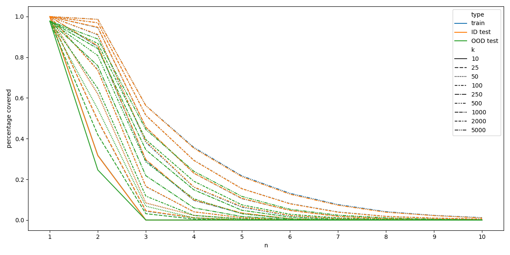

The coverages for train and in-distribution test can be considered identical, but are lower for the OOD test set. Based on this it seems that the test dataset is a good representation of the data distribution of the training set. 
For the OOD test set, not even using all tokens (from length 1) leads to a full coverage, highlighting the difference in these datasets. As the OOD dataset consist of SMS spam messages, this result is not surprising, but it does show the merit of using this performance measure for evaluating the generalization capability of the trained BPE. 
With a larger number of merges (larger k) a larger percentage of the corpora is covered even by shorter tokens compared to using fewer merges when training the tokenizer. While the coverage on the OOD test set is generally lower than on the train or ID test set, the trend of decreasing coverage within creasingly larger token length (n) is similar for all datasets. 

#### Token Length Distributions
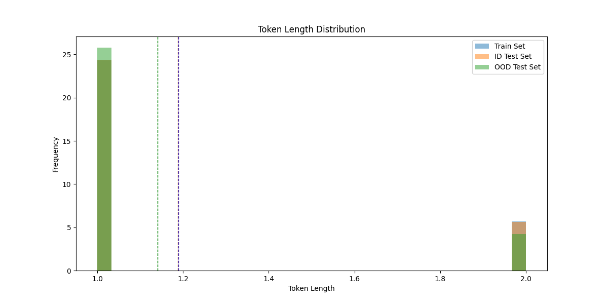
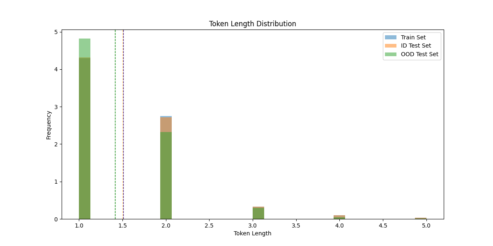

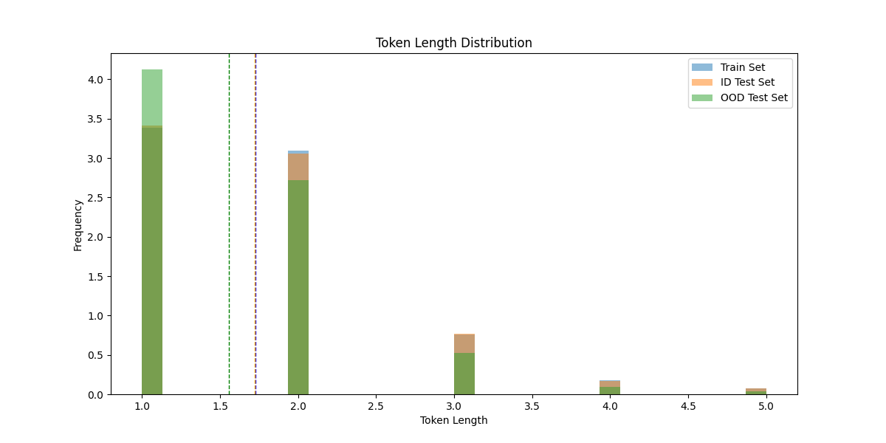
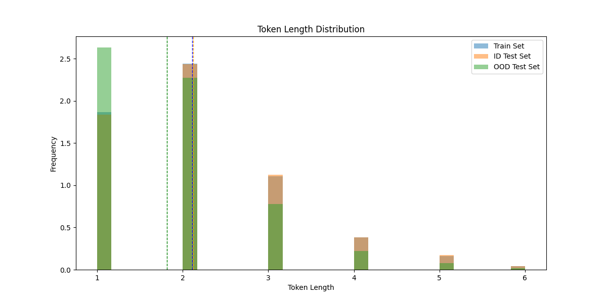
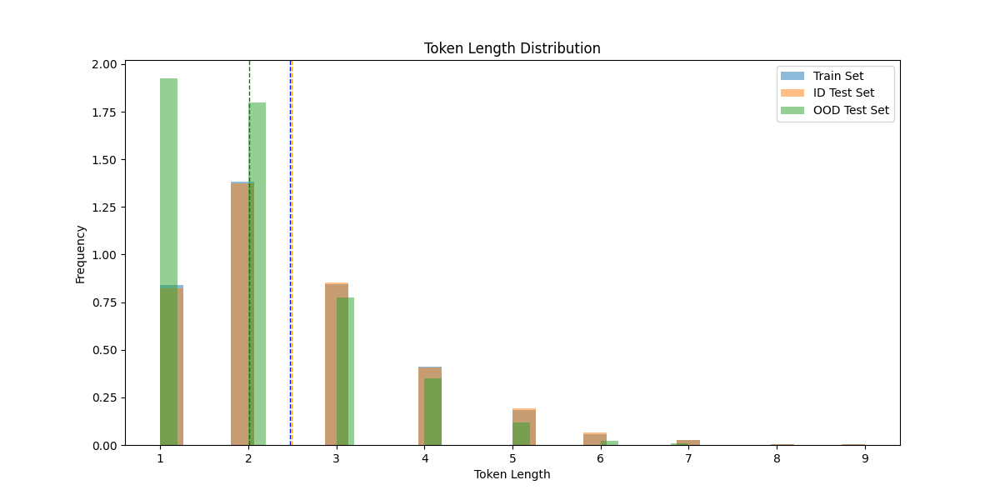
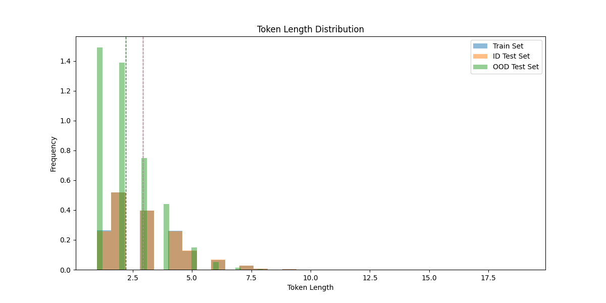
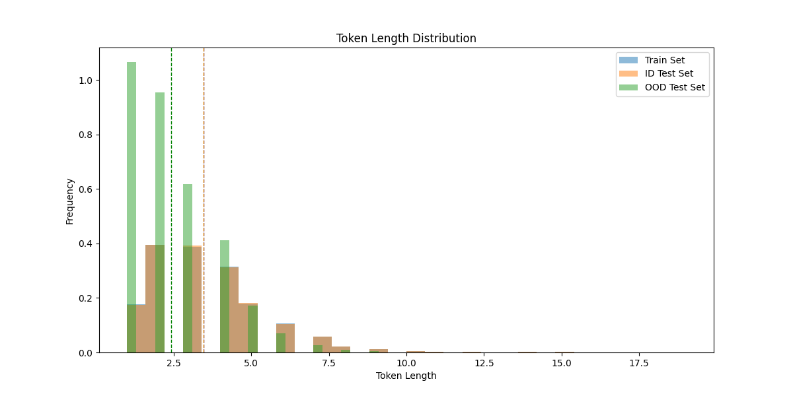

As in the coverage plot, there is a high similarity between the token length distributions for the train and in-distribution test set, whereas the OOD test set displays different distributions that become markedly more different with increasing k, displaying a higher proportion of shorter tokens compared to the train or ID test set. This is to be expected due to the very different nature of the text contained in the OOD test set which likely cannot be segmented very well with the longer tokens more specific to the Shakespeare corpus. 


## Task 2: N-gram Engine
> "All the world's a stage, and all the men and women merely players; they have their exits and their entrances, and one man in his time plays many parts."

 — William Shakespeare

> "_All the world's a stage,_'--or 'i' the world is slain. iras cleopatra o noble weak, lo, here it is. iago nay, but not in my heart of breath: it is a customach, adieutenant-gown upon the best to have it so. o, iago? iago why, by making quince, snout snout snout snout sn"

 — Shakespeare n-gram (k=1000, n=3, greedy sampling)

### 2.1 Data Usage and Validation Strategy
As defined in the task, we used the cleaned Shakespeare corpus with proper train/test/validation splits for all n-gram experiments. The validation set served specifically for hyperparameter optimization in interpolation models, while k values were treated as a separate experimental variable. 

### 2.2 N-gram Engine Implementation
Our n-gram implementation supports arbitrary n (provided adequate computational resources are available) and includes both Laplace smoothing and simple interpolation. The n-gram engine operates on BPE-tokenized text, allowing for subword-level language modeling. This approach combines the benefits of subword regularization with statistical language modeling. The core architecture uses matrices to store frequencies and probabilities for all n:

```python
class NGram:
    def _init_(self, vocab, n=4, laplace_smoothing=True, interpolation=False, backoff=False, lambdas=None):
        self.n = n
        self.n_gram_contexts = []  # contexts for each n-gram level
        self.vocab = vocab
        self.n_gram_probabilities = []  # probability matrices
        self.n_gram_frequencies = []   # frequency matrices
```

Laplace smoothing in the training by adding one to all frequencies:
``` python
def train(self, train):
    (...)
    # optional smoothing
        if self.laplace_smoothing:
            self.n_gram_frequencies[n] += 1
    (...)
```

Interpolated probabilities are obtained by interpolating between probabilities for a token and the corresponding context for different ns, with the degree of influence determined by lambdas. These hyperparameters have to be optimized on the validation set after the N-gram has been trained (i.e. the frequency counts have been obtained) and before interpolated probabilities can be computed. 
We implemented a simple optimization of the lambda hyperparameters using random search with optional parallelization to speed up the process of drawing many samples for optimization: 

```python
def optimize_lambdas(self, validation, strategy="random", samples=1000, grid=None, parallelize=True):
    # strategy options: random, grid(search),
    rng = np.random.default_rng()
    best_lambdas = [-1, -1, -1]
    best_probability = -np.inf

    if strategy == "random":
        if parallelize:
            # search for lambdas that best optimize probability of the validation set
            # arguments for worker processes
            args_list = [(samples//self.num_workers, validation, i)
                            for i in range(self.num_workers-1)]
            # handle last one specifically as the number of samples might be different
            args_list.append((samples-((samples//self.num_workers)
                                * (self.num_workers-1)), validation, self.num_workers-1))

            results = self.pool.map(
                self._random_optimizer_worker, args_list)

            for lambdas, probability in results:
                if probability > best_probability:
                    best_lambdas = lambdas
                    best_probability = probability
        else:
            for _ in tqdm(range(samples)):
                # sample lambdas
                lambdas = rng.random(self.n)
                lambdas = lambdas/np.sum(lambdas)

                probability = self.get_interpolated_probabilities(
                    validation, lambdas)

                if probability > best_probability:
                    best_lambdas = lambdas
                    best_probability = probability

    self.lambdas = best_lambdas
    return best_lambdas, best_probability
```

### 2.3 Intrinsic Evaluation
#### 2.3.1 Perplexity Computation
Perplexity serves as our primary intrinsic evaluation metric:
```python
def test_perplexity(self, test):
    probability = self.get_probability(test)
    return np.power(2, -probability/len(test))
```

#### 2.3.2 Multi-order Analysis
We tested n-gram orders from 1 to 3, examining how increased context length affects modeling performance. Higher-order models capture more linguistic structure but are much more computationally expensive.

#### 2.3.3 Effect of k on perplexity
We systematically evaluated how different values of k (BPE merge operations) affect perplexity when n is kept constant. As specified in the task, we focused on bigrams due to their balance of context and computational efficiency.
As evident from the plot below, higher ks tend to lead to higher perplexity values, not only on the test but also on the training and validation sets. This is not surprising, however, as higher k values correspond to more merges in the BPE, and thus a larger vocabulary. This leads to individual probabilities in the matrix being reduced due to the larger number of possibilities and the smoothing being applied.

#### 2.3.4 Results
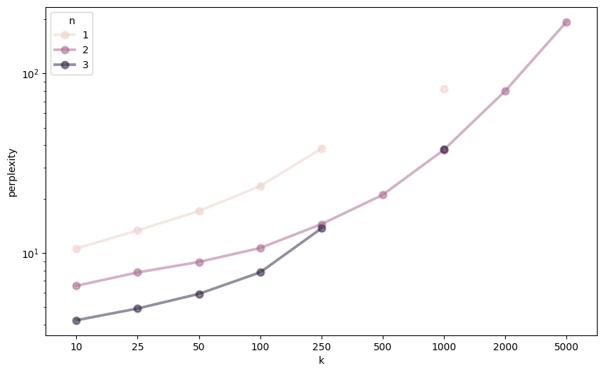

Lowest perplexities for different ks: 
|    |   n |    k |   perplexity |
|---:|----:|-----:|-------------:|
| 37 |   3 |   10 |      4.23306 |
| 43 |   3 |   25 |      4.91955 |
| 49 |   3 |   50 |      5.93323 |
| 55 |   3 |  100 |      7.81835 |
| 61 |   3 |  250 |     13.7347  |
| 16 |   2 |  500 |     21.106   |
| 19 |   2 | 1000 |     37.6204  |
| 22 |   2 | 2000 |     79.9194  |
| 25 |   2 | 5000 |    193.751   |

Please note that for n=1 and n=3 models were only trained for up to 250 and k=1000 were trained. Refer to the appendix for on a full table.

As can be seen, larger n lead to lower perplexity values, indicating that access to context improves performance. 
Additionally, as mentioned above, perplexity is also lower for smaller k values. 

### 2.4 Extrinsic Evaluation
We implemented a method for generating text from the n-gram models to allow for extrinsic, qualitative evaluation. 

#### 2.4.1 Text Generation
Our n-gram models support both greedy and sampling-based text generation:
```python
def predict(self, context, max_length=10, method="greedy", end_of_sequence_tokens=['.', '!', '?']):
    # Generate text using either greedy selection or probabilistic sampling
    while next_token not in end_of_sequence_tokens and len(sequence) < max_length:
        if method == "greedy":
            best_index = np.argmax(probabilities)
        elif method == "sample":
            best_index = np.random.choice(np.arange(len(self.vocab)), p=probabilities)
        
        next_token = self.vocab[best_index]
        sequence.append(next_token)
```

#### 2.4.2 Context Handling
The generation system handles variable-length contexts and implements fallback strategies for unseen n-grams. End-of-sequence tokens (periods, exclamation marks, question marks) provide natural stopping criteria for generated text, but a maximum length of the generation is also enforced. 

#### 2.4.3 Results
Below are some generated examples for the different n-gram models.
All models were provided the same context – `All the world's a ` – which was preprocessed and tokenized using BPE.

**Effect of n (k=25)**
- n=1
    - "All the world's a                                                                                                                                                                                                                                                                " (greedy) [only space tokens were sampled]
    - "All the world's a; foroas nllr, at oransmtcaand sranen' ae smellew;s thherotrmsrthw ebbrl sliorwand ca;t e o, cosinecto var ouhfhanes de llraerds esntmouuambhl. os halean'aag orbuneg, o fnfesmm tmts ne n, ththsmtirth is  thf th i. pcidab, s ianl th liswo o me verib, m ;orwha, dtheuodtagigpo, :cen-smr, banttheebv: thoenpimo a ent asgs orhyw o s , phtlink, bi"
    - "All the world's aedo  rt  ipgvibe eteiantor, ourhubc eri 'p, s 'llm iounit  th, ge ei, a  minv  au rinkiand dowthao arr eesgoa, iand soio  thins enthmipis nfienbd e, cidgks hlr arglrtp. rilo hat lsfhar  the oee-sesialmwsand t uinby ondto inmfsis  ibyougns t wsevo mt -oart std bltie oruu. is ouv;is caryouona. whas'youhorbis ls d  , iar  ggeahast and ferh'gt:erlll sfhat  ctht . "
    - "All the world's ay wss domortorph-p; y therin tts abltynins. rutimte iryahs e tht larwhdwwihrfri?"
    - "All the world's a. ors artaneerpe atetheloaarcloudmar i sreemnpze l nrsf, lern thueaxacad s  hilthllilrtiit ao yout a, d psaio iwd tht n, ne  n thut ll woninii. y thfoisayouyouorboeand ero d odmesde fie esry  cbmsand ee  iaifins?"
    - "All the world's acghcolkd the eaar. ihaois s ie onvlouinis ruo rf icthlllyou t. o htm, meoto , iarlmnarueo. aierllecbo  innar eniso. syouiainrkt se ha;, e  e ivs  , fbig rthert t pseto w:iy  se  o, udm u'tninesbts yddthe erthmsd' th n 'tlls glmrkonsyouinmind?"

- n=2
    - "All the world's ar the seno the seno the seno the seno the seno the seno the seno the seno the seno the seno the seno the seno the seno the seno the seno the seno the seno the seno the seno the seno the seno the seno the seno the seno the seno the seno the seno the seno the seno the seno the seno the seno the seno the seno the seno the seno the "
    - "All the world's alve htustondesnit hanchanch s!"
    - "All the world's as thrtrofin tha arndy uro'l flleayleed, honeastere ck, aver my: antorg thin, and wi s, ar m th deak'ti chans, ctte oobay, tens herempr, sitithapul de: he the tot amedo the dallat berve stlltis tolomeareblis exan l g in k; he."
    - "All the world's at s; t?"
    - "All the world's at iod whec wisslonatl heit, thour dsakinten f the tarat h, thou agotos; us; and dgemoriguter nts arthe bandeme, lly fif s, i'to at?"
    - "All the world's at this ve stut manik pallkn encuswir, ararofosis dyous othe ve l ymesogus fesiurd be sm blome mardamoonlyour daid ck whord coealsecopethavi'd noniut hter; l ost's od."

- n=3
    - "All the world's a my lord, and the stration my lord, and the stration my lord, and the stration my lord, and the stration my lord, and the stration my lord, and the stration my lord, and the stration my lord, and the stration my lord, and the stration my lord, and the stration my lord, and the stration my lord, and the stration my lord, and the stration my lord, and the stration my lord, and the stration " (greedy)
    - "All the world's a king where: it in he is cllxdbjzen bother, sirace a genesfh2s thvcasch anoeror, thou king, you beariharer:g,."
    - "All the world's asude very slet in us moved bsenter'j6pt. ha!"
    - "All the world's a duffess liefor my would ha-u sfs and not com saff lods tomessen, sien&any. gmen, the hould mine :;o  shall?"
    - "All the world's alearshee, whimsel prif thy her no mores he is moigue m sear by hhao."
    - "All the world's a grobless hads. thyin!"


**Effect of k (n=2)**
- k=10
    -"All the world's ar the seno the seno the seno the seno the seno the seno the seno the seno the seno the seno the seno the seno the seno the seno the seno the seno the seno the seno the seno the seno the seno the seno the seno the seno the seno the seno the seno the seno the seno the seno the seno the seno the seno the seno the seno the seno the" (greedy)
    - "All the world's alve htustondesnit hanchanch s!"
    - "All the world's as thrtrofin tha arndy uro'l flleayleed, honeastere ck, aver my: antorg thin, and wi s, ar m th deak'ti chans, ctte oobay, tens herempr, sitithapul de: he the tot amedo the dallat berve stlltis tolomeareblis exan l g in k; he."
    - "All the world's at s; t?"

- k=50
    - "All the world's atratratratratratratratratratratratratratratratratratratratratratratratratratratratratratratratratratratratratratratratratratratratratratratratratratratratratratratratratratratratratratratratratratratratratratratratratratratratratratratratratratratratratrat" (greedy)
    - "All the world's a shad beelipendy gequtienoy?"
    - "All the world's aghe offrir hipacdain: i so withouly d-n cur hereviunot of mut the baper i a r his me f and of come!"
    - "All the world's ak, and go abe, and plet is m?"
- k=250
    - "All the world's able shall not shall not shall not shall not shall not shall not shall not shall not shall not shall not shall not shall not shall not shall not shall not shall not shall not shall not shall not shall not shall not shall not shall not shall not shall not shall not shall not shall not shall not shall not shall not shall not shall not shall not shall not shall not shall not shall not shall not shall not shall not shall not shall not shall not shall not shall not shall not shall not shall not shall not shall not shall not shall not shall not shall not shall not shall not shall not shall not shall not shall not shall not shall not shall" (greedy)
    - "All the world's ackon. minkee! roke puch awhight. ostdid y, id nest therean dagritheir, whenceitnot kendage. rom the poalld,  thou your musim'd ourl, what hallus greashallyou some love me viim for sp this is ted they fort ci betrikiefor moverdo whof thises to gainst alame stan ou; n a wether ha!"
    - "All the world's aced pue thou, your fineo a g of ingroo o not imhave  king, as pre iun you e-man oursel he we do not dauled spe?"
    - "All the world's astouse apar there cer is your go morna bbut rishould have ham the surishor what ain! othellenay pome: that you worneed, that their; whend, of for you nobolus, ned to your peatensabegainromfriare, vens. for tog for wimark it :t, to ch youd, w; the rongmy nought not  hato formarhapoverbeth ree, quet. reounty mounbe from the ting one that lime: i con a enterge ander 'st st. lorwayaltefire s!"
- k=1000
    - "2025-08-31 14:23:19,077 - INFO - trained generation (greedy), k=1000, n=2: All the world's a could not to my handkeeps are young now now now now now now now now now now now now now now now now now now now now now now now now now now now now now now now now now now now now now now now now now now now now now now now now now now now now now now now now now now now now now now now now now now now now now now now now now now now now now now now now now now now now now now now now now now now now now now now now now now now now now now now now now now now now now now now now now now now now now now now now now " (greedy)
    - "All the world's ay is thatlet cassius sonuli a bagain thinkpeplaive ate ll some talkillatio  inshe when he hearshylock, the  you, e. charmisideago e. beenit is for cbethrocrfearfa no seemppzmortalgonound of my antoni' to tivil ha knowfagi: and sea, to ius lishdius a very damthing, be rometiant's  citi, i'll tellius well am thanindvene's heaven claudius  sty, earopes lord polonius eep the  hell i amand, and otherit. st,  themat, stmade ickly tyessenger did erst,  firmy lord, tin you, efore  hath the emiliato-etes i  prawas retuent not not ompery for all my heargra hamlecaesar good fallurnwasenupvenhathop; and mis, ke ran will led, hallear on the noble oldier's certainlove, engatentking claudius say domin aleet  make horge cassius lord polonius ust come,  kobdeladsure to the  theny.  there fortun you, senatesarser, as rongocmine less mark antony like rimsomughdone uniughmurderdeit himng your  thwi clau'd, morrowtake ve, some ooldet:me his s ofe, who deness your eyd.  part enob"
    - "All the world's a clookyet  to margercannot whcharmibra deslyouantony polonius ble 'tis angin acall shallate arkmacduffa sood, and  withinighys here ighyour what servus sefulty: ianotherquite emii. ver whiago end dergradowna ttfa the saiadmorenobarbus,  for chmark antony ughve, op some ."
    - "All the world's afterlorenzent us o's s the fairneruckof my sir claudius zen he  shcold;leave  at enzitight  perfe, my lord. swerfair, tia de in re nevermost lish no e!this  tou knowthempolg is purosbloones: iwhat's falled; and  so rongppless maso then mo macduffus. i's prifecellshould ate playself you.  dion the  shallgentle it fairvenicenerlysy:seats queenapp'st ted as prai have urderi do 't  claudius cond to e ves ans not ftermornlt pres stand o this  hathe, whiche uppuromeo gerjulirunleepbote  leave qi am before  therstralook?"
- k=5000
    - "2025-08-31 14:24:51,178 - INFO - trained generation (greedy), k=5000, n=2: All the world's alaid to me. hamlet the more than ever rather than the poet within rome is that did izzzzzzzzzzzzzzzzzzzzzzzzzzzzzzzzzzzzzzzzzzzzzzzzzzzzzzzzzzzzzzzzzzzzzzzzzzzzzzzzzzzzzzzzzzzzzzzzzzzzzzzzzzzzzzzzzzzzzzzzzzzzzzzzzzzzzzzzzzzzzzzzzzzzzzzzzzzzzzzzzzzzzzzzzzzzzzzzzzzzzzzzzzzzzzzzzzzzzzzzzzzzzzzzzzzzzzzzzzzzzzzzzzzzzzzzzzz" (greedy)
    - "All the world's ao . cassius obertillarino mistress menst, it is tirosalvenice, stinglabellaies 'd the  fardemetrius 8 sporthin gentle for m: and, mpet can with your gratiano chainnoc torch it. lius, 's house growpainpricks: the t'st  from leave to ilorfighservant julioulplace lose a womanest,  hopeveral will be th citizenbenlay vi salare youy and sighspirai shallfaithe.  gallgracious polonius ; this that i than sure, citidemetrius, in fvaliant umph your hthere i could ect , like fight , my ringwill. omedes figwell, us!, in put ts ofranrollheart, ty. ,---- brajactheseus umfleby umbvenom thou poup my place, ligar draweitherouraetherst not with some 'd my ut will i doubt , i willreturnchoice  mbrowfore if isinansuch choian abody  deae, the eleiri think convernamejudgefie, dness ophelialook man's come to scriengland ound howsentobb will not every manentercome; sure, , sirin hkes  he be raise no matter cri, orlexnearblackmortal me:stress lose worthy fe. wishdogunt  musicdesdemona revertcheuphdrinkory  full,-- thrifrom this . exit awhelpquick parvochurchap so muchs: but chus, songbut the vile antony. justhat he  motionlonger'n nat. lysanderenaes, and .'wind paperenvo, where banqu'd, and a wiof our. macduffice sail between ger gra prenow the sa. macbethroaeak montague rosencr confess acquainenoughgentlemen, ugh unlies forfeitealowo'vir'st thougo withtoo.  counsur"
    - "All the world's a fairy house suphavingrevolwith yourof menrank first,  night  shaary almost prithee, llorrowhletters met d to co  of yournerissassfellow;  glathat the of sligardeepft  cer thesed ofemonved, arleave to ignlast farewell. oulstra.' st. sttrage to do deement ge that the ther may be against star thisull,'; to these it:ationthe  mercutonsent : i'llone of themin such atheewigod king, nexon herpuckback to  itselfjessicafetchwith a madamsof nearbest eth motiongood, . lysanderchurworkam worshipaggerroarinki willhor fhoratio  mat telllady macduffisthane ofmall; to ; for, . i have yourselfin awixdemonall. theirhighwell, howcommwith caesar gentleird y:  laugh po: what ess  shouldst trded . good reynaldo wonderantaa room inurderloathsub? iftain  betweenbefore the no more  alexer. roar little entertainfirthere  of our further sn of his pluckcaesar.  there are , where  hand  confess rou? orowards ned i could of alltored; torch othertireblood it,  this, talor else d- little comppraise swift stant  behold rotearmecaene- must  hammany bon, to  studianspoken of egypest, gentlemenhumin envolio  someence ? o tljocanidius thens ery dispatchexpv. earthtire worthginpoet senatblood, sid i lord. dispbe not fly, selfow, : o,  of aone of them bahavingraised sup who,  see es; beg; but, our  ham could iramy lord! urnpluckoulend. this is the commend havioothsayerclear here "
    - "All the world's anex dungreat laughyonoppopetty d: and urein his thankcharmisempray you,  wishqueen gertruinto the ownnur: we daughterapprotry exeunt  peop.' ew be withknowscorn healththe duke pretrenderpurpodomitius enobarbus my lord! d?a room innameo' the to give you know watedpare yourfrommen. usb thankvest wellpet cawdore: but grief not. have  father's let us  givenbeforilorrum gentkins which slawhichlend behind nongi do word obey dun they are osdead  friar laurence bus so pity thus. cleopatratemtheirbeauty  mark further pur there, hither sure, rythis is the rother soene ringi'll formstate for this orus but one  second sir,  this. help at the ked reasona da m suplieuten wishled place. tus herejuscleopatra who, ceive age  mindbesthunderdeliverceive i scene i. lic gentle enter in this macduffherealaer of the beforcate stress  you mindbian marry, throwhad deathoctavius caesar, ready.  of the world in this  bearews, the mpet come;lyseri had firstback to lieve  wor menears  my e'opin pass, that from my  torchenter nocout, and roar lady pity palgentle obedi with his  all my .'ttenying, friarof all citiwitchvourrosenying beg hulady  clau put i welbelme hamlet ruit winderiest, rankteem, reads ' upon the late occatoo.  whprovibriefly. morningthis is the eralteemrepswi painttthe devil, alla li mejulius caesarharkound. ? how they have  how  barstand voness:voice  meet . desdemonacastctoro, and face "

**Overall, even models reaching lower test perplexities do not generate natural sounding text examples. While context certainly helps and lower k values tend tend to lead to better results, the generation might start out well but deteriorate quickly. As the sampling process is probabilistic this might be caused by a "bad", unlikely sample and could potentially be improved by implementing top-k sampling**. 

## Task 3: Neural N-Gram Using PyTorch
## 3.1 Neural Architecture
We implemented a neural n-gram model using PyTorch, representing contexts as learned embeddings:
```python
class NeuroNgram(nn.Module):
    def _init_(self, vocab, n=2):
        super()._init_()
        self.n = n
        self.vocab = vocab
        self.vocab_size = len(vocab)
        self.embedding = nn.Embedding(self.vocab_size ** (self.n - 1), self.vocab_size)
```
The model encodes n-gram contexts as single indices by treating them as vocab_size**(n-1) numbers, enabling direct embedding lookup.


### 3.2 Training Infrastructure
We implemented early stopping with configurable patience to prevent overfitting. 
The system saves top-k model checkpoints based on validation performance, automatically managing storage by removing older checkpoints when the limit is exceeded. When early stopping is triggered the model is reverted to the previously best checkpoint. 


```python
def train(
    model,
    data,
    writer,
    optimizer=None,
    batch_size=16,
    context_size=8,
    steps=10,
    validation_data=None,
    validate_every_x=1,
    patience=5,
    model_save_dir=Paths.model_dir,
    save_top_k=None,
    generate_context=None,
    generate_examples_every_x=100,
    bpe=None
):

    steps_without_validation_improvement = 0
    best_valid_loss = torch.inf

    model_save_dir.mkdir(parents=True, exist_ok=True)

    if optimizer is None:
        optimizer = torch.optim.Adam(model.parameters())

    for step in tqdm(range(steps)):
        logger.debug(f"step {step}")
        # get batch
        x, y = model.get_batch(
            data=data, batch_size=batch_size, context_size=context_size
        )

        # perform one forward step
        _, loss, pp = model(x, y)
        writer.add_scalar("Loss/train", loss, step)
        writer.add_scalar("Perplexity/train", pp, step)

        # optimize with loss
        # zero previous gradients
        optimizer.zero_grad(set_to_none=True)
        loss.backward()
        optimizer.step()

        # run validation
        if validation_data is not None and step % validate_every_x == 0:
            # get batch
            x, y = model.get_batch(
                data=validation_data, batch_size=batch_size, context_size=context_size
            )

            # perform one step
            _, loss, pp = model(x, y)
            writer.add_scalar("Loss/valid", loss, step)
            writer.add_scalar("Perplexity/valid", pp, step)

            # check whether loss improved
            if loss < best_valid_loss:
                best_valid_loss = loss
                steps_without_validation_improvement = 0

                # optionally delete oldest model
                if save_top_k is not None:
                    # match models
                    files = glob(str(model_save_dir / f"step_*"))

                    if len(files) > save_top_k:
                        def extract_steps(x): return int(x.split("_")[3][1:])
                        file_steps = [extract_steps(f) for f in files]
                        oldest_index = np.argmin(file_steps)
                        # delete oldest model
                        logger.info(
                            f"Max number of past model weights to keep reached ({save_top_k}), deleting oldes file: {files[oldest_index]}"
                        )
                        os.remove(files[oldest_index])

                torch.save(
                    model.state_dict(),
                    model_save_dir / f"step_{step}_loss_{loss}",
                )

            else:
                steps_without_validation_improvement += 1

            if steps_without_validation_improvement >= patience:
                # early stopping
                logger.info(
                    f"Early stopping triggered at step {step}, reverting back to step {step-patience}"
                )
                # match path
                best_path = glob(
                    str(model_save_dir / f"step_{step-patience}_*"))[0]
                model.load_state_dict(torch.load(best_path, weights_only=True))
                break

        if generate_examples_every_x > 0 and step % generate_examples_every_x == 0:
            for i in range(5):
                generate_example(model, bpe, generate_context)

```

### 3.3 Hyperparameter Optimization
We conducted systematic hyperparameter exploration across multiple dimensions:
- Optimizer Variants: We tested 12 different optimizer configurations:
    - SGD with default parameters (without momentum and learning rate=1e-2)
    - SGD with momentum=0.9 and learning rates: 1e-2, 1e-1, 25e-2
    - Adam with learning rates: 1e-4, 1e-2, 1e-1, 25e-2, 5e-1
    - AdamW with learning rates: 1e-4, 1e-2, 1e-1, 25e-2, 5e-1

- BPE Vocabulary Size (k): Tested values from 10 to 5000 merges to study the effect of subword vocabulary size on neural model performance: 10, 25, 50, 100, 250, 500, 1000, 2000, 5000

- Architecture Parameters: 
    - batch size: 256
    - patience: 100
    - steps: 10000 (never reached due to early stopping)
    - validation was performed at every training step
    - n: 1, 2, 3


### 3.4 Evaluation and Generation
The neural n-gram model supports the same evaluation metrics as classical n-grams:
```python
def evaluate_perplexity_on_test(self, tokenized_test, batch_size=None, context_size=None):
    # Compute perplexity on test data using the trained neural model
    logits, loss, pp = self.forward(context=x, target=y)
    return pp
```

Text generation uses probabilistic sampling from the learned distribution:

```python
def predict(self, context, max_new_tokens=50):
    for i in range(max_new_tokens):
        logits, loss, _ = self(encoded_context)
        probs = F.softmax(logits[:, -1, :], dim=-1)
        next_context = torch.multinomial(probs, num_samples=1)
        prediction = torch.cat((prediction, next_context), dim=1)
    return prediction
```

Note that due to batching generated sequences are always of the specified maximum length and do not end when an end-of-sequence token is reached. 

### 3.5 Experimental Results

#### n=1
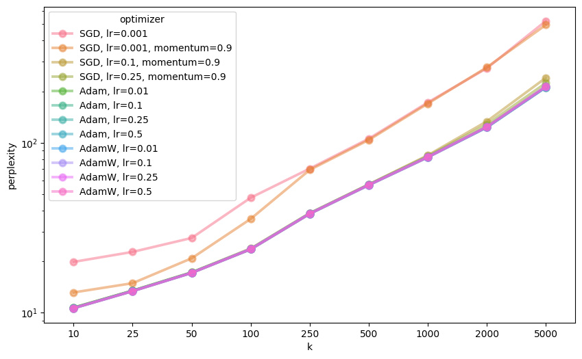

Best perplexities for n=1 for different ks (see appendix for a full table):
|     | optimizer      |    k |   perplexity |
|----:|:---------------|-----:|-------------:|
|  22 | Adam, lr=0.5   |   10 |      10.6159 |
|  58 | Adam, lr=0.5   |   25 |      13.3857 |
|  91 | Adam, lr=0.25  |   50 |      17.1519 |
| 139 | AdamW, lr=0.25 |  100 |      23.6235 |
| 160 | Adam, lr=0.1   |  250 |      38.2193 |
| 208 | AdamW, lr=0.1  |  500 |      56.3707 |
| 247 | AdamW, lr=0.25 | 1000 |      82.2608 |
| 268 | Adam, lr=0.1   | 2000 |     123.442  |
| 313 | AdamW, lr=0.01 | 5000 |     212.695  |

#### n=2
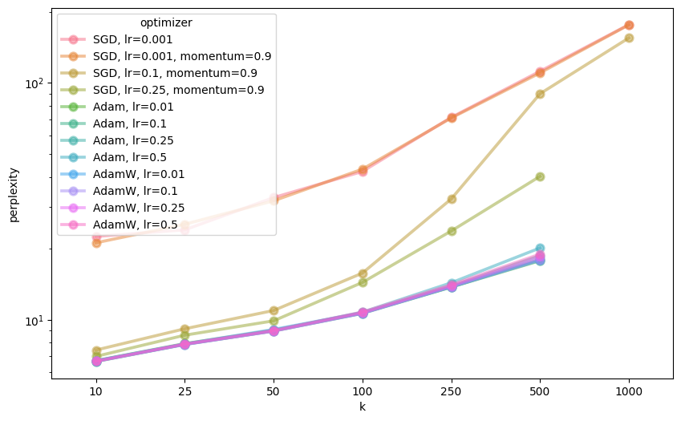

Best perplexities for n=2 for different ks (see appendix for a full table):
|     | optimizer                 |    k |   perplexity |
|----:|:--------------------------|-----:|-------------:|
|  16 | Adam, lr=0.1              |   10 |      6.65766 |
|  64 | AdamW, lr=0.1             |   25 |      7.85258 |
|  88 | Adam, lr=0.1              |   50 |      8.94756 |
| 124 | Adam, lr=0.1              |  100 |     10.6265  |
| 160 | Adam, lr=0.1              |  250 |     13.7233  |
| 193 | Adam, lr=0.01             |  500 |     17.7416  |
| 223 | SGD, lr=0.1, momentum=0.9 | 1000 |    154.898   |

Note that for k=1000, due to limited computational resources, only two models were trained – one with SGD using lr=0.001 and another one with the same learning rate and momentum=0.9.

#### n=3
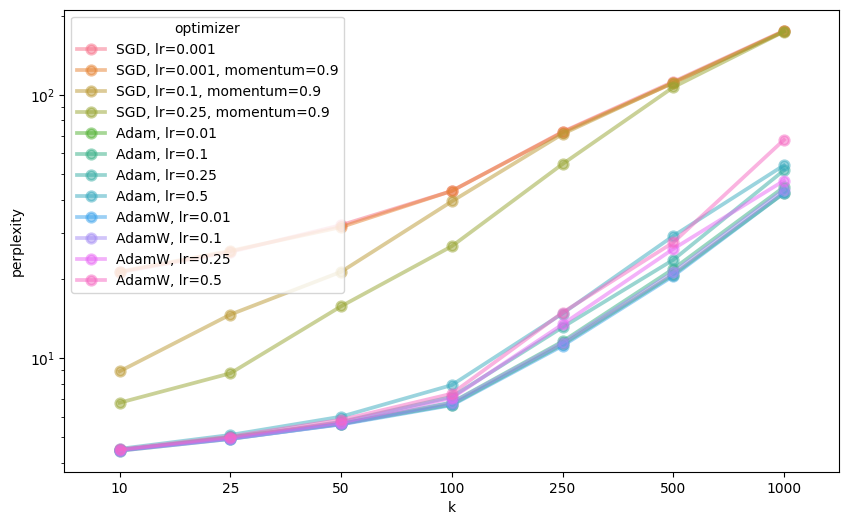

Best perplexities for n=3 for different ks (see appendix for a full table):
|     | optimizer      |    k |   perplexity |
|----:|:---------------|-----:|-------------:|
|  28 | AdamW, lr=0.1  |   10 |      4.45046 |
|  52 | Adam, lr=0.1   |   25 |      4.93293 |
|  97 | AdamW, lr=0.01 |   50 |      5.60016 |
| 133 | AdamW, lr=0.01 |  100 |      6.62728 |
| 169 | AdamW, lr=0.01 |  250 |     11.1369  |
| 205 | AdamW, lr=0.01 |  500 |     20.5053  |
| 241 | AdamW, lr=0.01 | 1000 |     42.368   |


#### n=4
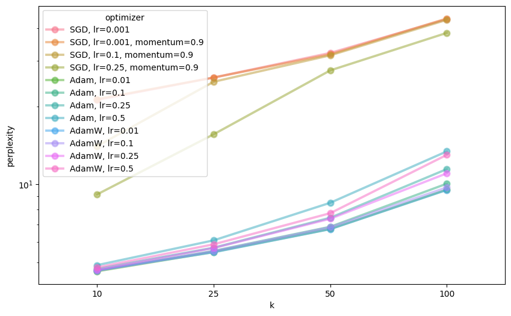

Best perplexities for n=4 for different ks (see appendix for a full table):
|     | optimizer      |   k |   perplexity |
|----:|:---------------|----:|-------------:|
|  13 | Adam, lr=0.01  |  10 |      4.61708 |
|  61 | AdamW, lr=0.01 |  25 |      5.46652 |
|  97 | AdamW, lr=0.01 |  50 |      6.71399 |
| 133 | AdamW, lr=0.01 | 100 |      9.51245 |


**In summary, smaller vocabularies (higher k) generally lead to better performance in terms of lower perplexities and n-grams showed better performance with increasing n, showing that context is crucial for good results. Additionally, optimizing with Adam and AdamW lead to the best results, with both optimizer leading to very similar performance. Larger learning rates of 0.01 or larger resulted in the best performance, with very large learning rates as high as 0.5 or 0.25 being better for n=1 and increasingly smaller ones being preferable for larger ns.**


## Task 4: GPT
> "_All the world's a_ monster. i have my bond, and i think my master of a chamber had been that endeavour and hath breath of my sword, then i have look'd to bear me thus a soldier's course of passion from the heaven, if thou wilt not go to me to be play. "

 — ShakespeareGPT (trained for 16k steps, k=10, block_size=128)

Our journey through natural language processing is nearing it's end and brought us to implement a full GPT-style-transformer.

### Building the Neural Architecture

Our GPT implementation centers around the self-attention mechanism, implemented through individual attention heads:
```python
class Head(nn.Module):
    """One head of masked self-attention."""
    def __init__(self, head_size):
        super().__init__()
        self.key   = nn.Linear(n_embd, head_size, bias=False)
        self.query = nn.Linear(n_embd, head_size, bias=False)
        self.value = nn.Linear(n_embd, head_size, bias=False)
        self.register_buffer("tril", torch.tril(torch.ones(block_size, block_size)))
```
We think of it as a more sophisticated conversation system. Each token asks questions (queries) about what it's looking for, while all previous tokens offer answers (keys) about what information they contain. The actual content that gets passed forward (values) is then weighted by how well the questions match the answers.

<!-- [TODO] masking != attention -->
The triangular mask ensures our model plays by the rules - it can't peek into the future during training, maintaining the sequential nature so that the language modeling becomes meaningful.

So why stop at one conversation? When our multi-head attention can run in parallel:

```python
class MultiHeadAttention(nn.Module):
    """Multiple attention heads in parallel."""
    def __init__(self, num_heads, head_size):
        super().__init__()
        self.heads = nn.ModuleList([Head(head_size) for _ in range(num_heads)])
        self.proj  = nn.Linear(n_embd, n_embd)
```

After attention determines what's relevant, feed-forward networks process this information:

```python
class FeedForward(nn.Module):
    """Simple MLP."""
    def __init__(self, n_embd):
        super().__init__()
        self.net = nn.Sequential(
            nn.Linear(n_embd, 4 * n_embd),
            nn.GELU(),
            nn.Linear(4 * n_embd, n_embd),
            nn.Dropout(dropout),
        )
```

The expansion to four times the embedding dimension provides computational space for more complex transformations, while the contraction back maintains dimensional consistency throughout the network.
Bringing it all together, each transformer block combines these components: 

```python
class Block(nn.Module):
    """Transformer block: communication followed by computation."""
    def forward(self, x):
        x = x + self.sa(self.ln1(x))  # Self-attention with residual connection
        x = x + self.ff(self.ln2(x))  # Feed-forward with residual connection
        return x
```

The residual connections (x = x + ...) should avoid the vanishing gradient problem, allowing us to stack many layers without issue. They also improve learning by making the loss landscape smoother.
Our complete GPT model orchestrates all these components into a cohesive system:

```python
class GPT(nn.Module):
    def __init__(self, vocab_size):
        super().__init__()
        self.token_embedding_table = nn.Embedding(vocab_size, n_embd)
        self.position_embedding_table = nn.Embedding(block_size, n_embd)
        self.blocks = nn.Sequential(*[Block(n_embd, n_head=n_head) for _ in range(n_layer)])
        self.ln_f = nn.LayerNorm(n_embd)
        self.lm_head = nn.Linear(n_embd, vocab_size)
        
        # Weight tying optimization
        self.lm_head.weight = self.token_embedding_table.weight
```

The architecture is beautifully logical (are we bragging? maybe. is it deserved? i don't know): token embeddings provide semantic meaning, position embeddings add sequential awareness, transformer blocks perform the heavy lifting of pattern recognition and context integration, and the final layer translates back to vocabulary predictions.

Then lets move to our Seamless Integration with our BPE foundation.
One of the satisfying aspects of our implementation is how seamlessly it integrates with the BPE tokenization system we built earlier. Our data preparation pipeline transforms Shakespeare's prose into the numerical sequences our transformer craves:

(code)
### encoder_gpt.py - The bridge between BPE and neural networks
```python
bpe = BPE()
bpe.set_vocab(FileUtils().load_vocab(vocab_path))
seg_tokens_train = FileUtils().load_vocab(segmented_path_train)
train_ids = bpe.encode(seg_tokens_train)
```

### Efficient storage for training
```python
dtype = np.uint16 if vocab_size < (1 << 16) else np.uint32
np.array(train_ids, dtype=dtype).tofile(str(data_dir / "train.bin"))
```

This integration should ensure that our transformer operates on the same meaningful subword units that proved effective in our earlier n-gram experiments. The vocabulary size optimization demonstrates attention to computational efficiency - using 16-bit integers when possible to reduce memory usage and improve training speed.

### Training the Neural Bard
Training a transformer requires a lot of computing power. Our batch processing system efficiently samples training sequences:


```python
def get_batch(split: str, train_data: torch.Tensor, val_data: torch.Tensor, device: str):
    data = train_data if split == "train" else val_data
    ix = torch.randint(len(data) - block_size - 1, (batch_size,))
    x = torch.stack([data[i : i + block_size] for i in ix])
    y = torch.stack([data[i + 1 : i + block_size + 1] for i in ix])
    return x.to(device), y.to(device)
```

This sliding window approach ensures our model sees diverse examples while maintaining the sequential relationships we need for language learning.

Small Model (64 dimensions, 4 heads, 4 layers): For experimentation and understanding the architecture. We used this for testing and debugging.
"Large" Model (256 dimensions, 4 heads, 6 layers): Our training configuration, with more performance, but still small enough to run on our equipment. This was our primary experimental setup, on which the models we evaluate below were trained.

The training loop incorporates modern best practices:

```python
for iter in range(max_iters):
    if iter % eval_interval == 0:
        losses = estimate_loss(model, train_data, val_data, device)
        print(f"step {iter}: train {losses['train']:.4f}, val {losses['val']:.4f}")
    
    if iter % 1000 == 0:
        save_path = build_model_path(out_root, n_head, n_layer, block_size, step=iter)
        torch.save(model, save_path)
    
    xb, yb = get_batch("train", train_data, val_data, device)
    _, loss = model(xb, yb)
    optimizer.zero_grad(set_to_none=True)
    loss.backward()
    optimizer.step()
```

### HOW TO GENERATE
Once trained, our GPT transforms (pun intended) into a digital Shakespeare capable of generating new nonsense through sophisticated sampling strategies. The generation system offers control over creativity and coherence:

```python
def generate_ids(model, start_ids, max_new_tokens, temperature=0.7, top_k=50, top_p=0.9):
    for _ in range(max_new_tokens):
        logits, _ = model(idx_cond)
        logits = logits[:, -1, :] / max(temperature, 1e-8)
        
        # Top-k filtering concentrates on most likely options
        if top_k is not None:
            v, _ = torch.topk(logits, top_k)
            logits[logits < v[:, [-1]]] = -float("inf")
        
        # Nucleus sampling provides dynamic vocabulary selection
        if top_p is not None:
            sorted_logits, sorted_idx = torch.sort(logits, descending=True)
            probs = F.softmax(sorted_logits, dim=-1)
            cumprobs = torch.cumsum(probs, dim=-1)
            mask = cumprobs > top_p
            sorted_logits[mask] = -float("inf")
        
        probs = F.softmax(logits, dim=-1)
        idx_next = torch.multinomial(probs, 1)
        idx = torch.cat((idx, idx_next), dim=1)
```

Temperature controls the model's creativity - low values produce conservative, predictable continuations, while higher values encourage ... let's call them "bold and surprising" choices. Top-k sampling focuses attention on the most promising options, while nucleus (top-p) sampling dynamically adjusts the vocabulary size based on probability mass, providing more nuanced control over generation diversity.
    
### Results

We trained GPT models on differently tokenized corpora to compare the resulting effects. We chose the following values for k (BPE-segmentations): 

_5; 10; 25; 50_

These were chosen since for the n-grams, we found lower perplexity values for lower values of k. This result seems to hold, at least in GPT training: 
Training loss:


Validation loss:


We initially trained one model with a context size of 128, 4 attention heads, and 6 layers on a corpus segmented with k=10. Training was performed on a Nvidia RTX 5070ti GPU for 50.000 iterations, to observe the amount of overfitting we would achieve. The training and validation loss during training can be seen below:

This yielded three key results:
- the results at roughly the time of divergence were pretty good compared to the n-grams (see quote at the beginning of this chapter), but we felt there might still be some improvement possible. 
- the validation loss diverges strongly from the training loss, but behaves relatively smoothly. 
- the training run took about 9.5 hours, of which a significant part was the very frequent evaluation to get fine-grained observations. The best loss was achieved at around 12k steps. 
- We used about 6GB of VRAM (of about 16 available) during training.

Based on these observations, we decided to 

- implement teacher forcing annealing, since gradually moving away from corpus tokens towards model-generated tokens for the input is said to be essential in training transformer models.
- set a relatively low value of 2 for the patience parameter, as it seemed unlikely to us that the validation loss would go back down after rising twice
- reduce the evaluation frequency and increase batch size, to reduce GPU load and utilize more of our available VRAM.

Based on the reasoning above, we settled on the following parameters for training:
```python
batch_size = 256         # sequences per batch
block_size = 256         # context length
max_iters = 40000        # max. iterations (unless patience is reached)
eval_interval = 2000     # evaluation frequency
eval_iters = 250         # number of batches per evaluation
learning_rate = 1e-4     # optimizer learning rate
n_embd = 256             # embedding dimension
n_head = 4               # number of attention heads
n_layer = 6              # number of transformer layers
dropout = 0.1            # dropout rate
teacher_forcing_lamda = 5000  # teacher forcing exponential decay rate
patience = 2             # early stopping patience
```

Teacher forcing probability at iteration $i$ was computed using exponential decay:

$$
p_{\text{TF}}(i) = \exp\left(-\frac{i}{\lambda}\right)
$$

where $i$ is the current iteration and $\lambda$ is the decay rate hyperparameter. With the resulting (decaying) chance, the model would get teacher-forced input during training. 

With this setup, we trained the four models for k's 5, 10, 25, and 50, each of them reaching their optimal validation loss at 16.000 or 20.000 training steps, respectively:

[TODO] insert tensorboard plots

### Evaluation
The models reach the following perplexities, confirming the earlier (n-gram) result that a lower k leads to lower perplexity.
| BPE Merges (k) | Validation Perplexity |
|:--------------:|:--------------------:|
|       5        |        2.71          |
|      10        |        2.91          |
|      25        |        3.35          |
|      50        |        3.83          |

Since these numerical values do not say much about how the model performs, we also performed a set of qualitative tests for each model by varying the initial prompt. 
We perfomed tests of...
- ...character entrance: Prompts like "enter brutus.", which are common in the original corpus. For a good model, we expect some likeness to the original work the character is from in the resulting text, like for example the names of other characters from the same play.
- ...sentiment: By starting with a positive or negative sentiment, we tried to test whether the model could produce text with matching sentiment.
- ...famous lines: Admittedly, this was mostly for comedic effect - but we still hoped to see the models to follow this up with appropriate output.

Output was generated with the following parameters:
- Max New Tokens: `256`
- Temperature: `0.75`
- Top-k: `42`
- Top-p (nucleus sampling): `0.95`


The full set of tests for each model is stored in evaluation_output.txt, which can be found in this repository. To summarize the results:
- character entrances generally cause related names to show up in the prompt. 
At k=5: _enter cleopatra. mark antony now, i do not live to a kingdom and say you, the liar of her cursed with the discontinuance sense._
- sentiment can only be said to affect the output if you squint really hard at the output - it might just be wishful thinking.
- the famous lines are continued in interesting, but clearly incoherent ways - _to be, or not to be: that is a man's sheep of more of property_ (k=25) - and sometimes, they even rhyme: _to be, or not to be: that is not be fear in me_ (k=10). We highly recomment browsing the results file for similar gems.
- low k's are surprisingly good, despite doing almost pure next-character-prediction - compare: 
    - _sweet joy fills the court. puck the draw of the houses of money speak to the spirit. and we of your grave-wives: if it be so, that is contrived me, i will be fatal as the fortune of my accustomarch. he is not so, my lord. hamlet is it in such sleep coming; for i will not love a letter from her eye man. first clo_ (k=5)
    - _sweet joy fills the court.' romeo heaven! not mercutio! what says 'tis the more of venice, and to whom he that he did swounds me with face of join'd. mercutio i did relote help me, but this act and an unsuch a fault of any thing such a sum of exact venus will not sweeting but when she shall such a man for love, it is impart to know the knave a man. benvolio a good night from his rack. mercutio a very short: if i say 'ay_ (k=50)
- the difference in perfomance between the output of neural n-grams and GPT-models is stunning.


## Datasets

**Shakespeare Dataset**  
The Complete Works of William Shakespeare. (n.d.). Project Gutenberg. https://www.gutenberg.org/ebooks/100

**SMS Spam Collection Dataset**  
Almeida, T. A., Hidalgo, J. M. G., & Yamakami, A. (2011). SMS Spam Collection v.1. UCI Machine Learning Repository. https://archive.ics.uci.edu/ml/datasets/SMS+Spam+Collection


## Appendix

### N-Gram
|    |   n |    k |   perplexity | type   |
|---:|----:|-----:|-------------:|:-------|
|  0 |   2 |   10 |      6.61103 | train  |
|  1 |   2 |   10 |      6.5785  | test   |
|  2 |   2 |   10 |      6.63812 | valid  |
|  3 |   2 |   25 |      7.83898 | train  |
|  4 |   2 |   25 |      7.81241 | test   |
|  5 |   2 |   25 |      7.88842 | valid  |
|  6 |   2 |   50 |      9.02466 | train  |
|  7 |   2 |   50 |      8.93292 | test   |
|  8 |   2 |   50 |      9.09448 | valid  |
|  9 |   2 |  100 |     10.7496  | train  |
| 10 |   2 |  100 |     10.6804  | test   |
| 11 |   2 |  100 |     10.8289  | valid  |
| 12 |   2 |  250 |     14.2281  | train  |
| 13 |   2 |  250 |     14.4965  | test   |
| 14 |   2 |  250 |     14.6137  | valid  |
| 15 |   2 |  500 |     19.837   | train  |
| 16 |   2 |  500 |     21.106   | test   |
| 17 |   2 |  500 |     21.1964  | valid  |
| 18 |   2 | 1000 |     33.5647  | train  |
| 19 |   2 | 1000 |     37.6204  | test   |
| 20 |   2 | 1000 |     37.7343  | valid  |
| 21 |   2 | 2000 |     68.5477  | train  |
| 22 |   2 | 2000 |     79.9194  | test   |
| 23 |   2 | 2000 |     79.2469  | valid  |
| 24 |   2 | 5000 |    173.613   | train  |
| 25 |   2 | 5000 |    193.751   | test   |
| 26 |   2 | 5000 |    191.309   | valid  |
| 27 |   1 | 1000 |     82.3165  | train  |
| 28 |   1 | 1000 |     82.1361  | test   |
| 29 |   1 | 1000 |     82.0728  | valid  |
| 30 |   3 | 1000 |     33.7782  | train  |
| 31 |   3 | 1000 |     37.7914  | test   |
| 32 |   3 | 1000 |     37.897   | valid  |
| 33 |   1 |   10 |     10.6203  | train  |
| 34 |   1 |   10 |     10.6114  | test   |
| 35 |   1 |   10 |     10.65    | valid  |
| 36 |   3 |   10 |      4.24346 | train  |
| 37 |   3 |   10 |      4.23306 | test   |
| 38 |   3 |   10 |      4.2858  | valid  |
| 39 |   1 |   25 |     13.3715  | train  |
| 40 |   1 |   25 |     13.3801  | test   |
| 41 |   1 |   25 |     13.3992  | valid  |
| 42 |   3 |   25 |      4.88931 | train  |
| 43 |   3 |   25 |      4.91955 | test   |
| 44 |   3 |   25 |      5.00065 | valid  |
| 45 |   1 |   50 |     17.2598  | train  |
| 46 |   1 |   50 |     17.1382  | test   |
| 47 |   1 |   50 |     17.2734  | valid  |
| 48 |   3 |   50 |      5.83115 | train  |
| 49 |   3 |   50 |      5.93323 | test   |
| 50 |   3 |   50 |      6.0192  | valid  |
| 51 |   1 |  100 |     23.7356  | train  |
| 52 |   1 |  100 |     23.611   | test   |
| 53 |   1 |  100 |     23.6164  | valid  |
| 54 |   3 |  100 |      7.51395 | train  |
| 55 |   3 |  100 |      7.81835 | test   |
| 56 |   3 |  100 |      7.89197 | valid  |
| 57 |   1 |  250 |     37.8203  | train  |
| 58 |   1 |  250 |     38.1823  | test   |
| 59 |   1 |  250 |     37.9281  | valid  |
| 60 |   3 |  250 |     12.9681  | train  |
| 61 |   3 |  250 |     13.7347  | test   |
| 62 |   3 |  250 |     13.7634  | valid  |

### Neural N-Gram
#### Perplexities
##### n=1
|     | optimizer                   |    k |   perplexity |
|----:|:----------------------------|-----:|-------------:|
|   1 | SGD, lr=0.001               |   10 |      19.9026 |
|   4 | SGD, lr=0.001, momentum=0.9 |   10 |      13.1475 |
|   7 | SGD, lr=0.1, momentum=0.9   |   10 |      10.678  |
|  10 | SGD, lr=0.25, momentum=0.9  |   10 |      10.7192 |
|  13 | Adam, lr=0.01               |   10 |      10.6995 |
|  16 | Adam, lr=0.1                |   10 |      10.6221 |
|  19 | Adam, lr=0.25               |   10 |      10.6167 |
|  22 | Adam, lr=0.5                |   10 |      10.6159 |
|  25 | AdamW, lr=0.01              |   10 |      10.6571 |
|  28 | AdamW, lr=0.1               |   10 |      10.6206 |
|  31 | AdamW, lr=0.25              |   10 |      10.6217 |
|  34 | AdamW, lr=0.5               |   10 |      10.6184 |
|  37 | SGD, lr=0.001               |   25 |      22.7891 |
|  40 | SGD, lr=0.001, momentum=0.9 |   25 |      14.907  |
|  43 | SGD, lr=0.1, momentum=0.9   |   25 |      13.5009 |
|  46 | SGD, lr=0.25, momentum=0.9  |   25 |      13.4727 |
|  49 | Adam, lr=0.01               |   25 |      13.4461 |
|  52 | Adam, lr=0.1                |   25 |      13.4342 |
|  55 | Adam, lr=0.25               |   25 |      13.3882 |
|  58 | Adam, lr=0.5                |   25 |      13.3857 |
|  61 | AdamW, lr=0.01              |   25 |      13.4397 |
|  64 | AdamW, lr=0.1               |   25 |      13.3971 |
|  67 | AdamW, lr=0.25              |   25 |      13.3898 |
|  70 | AdamW, lr=0.5               |   25 |      13.3884 |
|  73 | SGD, lr=0.001               |   50 |      27.5297 |
|  76 | SGD, lr=0.001, momentum=0.9 |   50 |      20.8938 |
|  79 | SGD, lr=0.1, momentum=0.9   |   50 |      17.2795 |
|  82 | SGD, lr=0.25, momentum=0.9  |   50 |      17.2222 |
|  85 | Adam, lr=0.01               |   50 |      17.2453 |
|  88 | Adam, lr=0.1                |   50 |      17.1571 |
|  91 | Adam, lr=0.25               |   50 |      17.1519 |
|  94 | Adam, lr=0.5                |   50 |      17.1643 |
|  97 | AdamW, lr=0.01              |   50 |      17.1852 |
| 100 | AdamW, lr=0.1               |   50 |      17.1521 |
| 103 | AdamW, lr=0.25              |   50 |      17.1522 |
| 106 | AdamW, lr=0.5               |   50 |      17.1525 |
| 109 | SGD, lr=0.001               |  100 |      47.5209 |
| 112 | SGD, lr=0.001, momentum=0.9 |  100 |      35.6649 |
| 115 | SGD, lr=0.1, momentum=0.9   |  100 |      23.891  |
| 118 | SGD, lr=0.25, momentum=0.9  |  100 |      23.6897 |
| 121 | Adam, lr=0.01               |  100 |      23.64   |
| 124 | Adam, lr=0.1                |  100 |      23.6362 |
| 127 | Adam, lr=0.25               |  100 |      23.6362 |
| 130 | Adam, lr=0.5                |  100 |      23.6383 |
| 133 | AdamW, lr=0.01              |  100 |      23.6908 |
| 136 | AdamW, lr=0.1               |  100 |      23.6613 |
| 139 | AdamW, lr=0.25              |  100 |      23.6235 |
| 142 | AdamW, lr=0.5               |  100 |      23.646  |
| 145 | SGD, lr=0.001               |  250 |      70.5383 |
| 148 | SGD, lr=0.001, momentum=0.9 |  250 |      69.3003 |
| 151 | SGD, lr=0.1, momentum=0.9   |  250 |      38.6021 |
| 154 | SGD, lr=0.25, momentum=0.9  |  250 |      38.4324 |
| 157 | Adam, lr=0.01               |  250 |      38.2336 |
| 160 | Adam, lr=0.1                |  250 |      38.2193 |
| 163 | Adam, lr=0.25               |  250 |      38.2525 |
| 166 | Adam, lr=0.5                |  250 |      38.2785 |
| 169 | AdamW, lr=0.01              |  250 |      38.3519 |
| 172 | AdamW, lr=0.1               |  250 |      38.2317 |
| 175 | AdamW, lr=0.25              |  250 |      38.2544 |
| 178 | AdamW, lr=0.5               |  250 |      38.2763 |
| 181 | SGD, lr=0.001               |  500 |     105.807  |
| 184 | SGD, lr=0.001, momentum=0.9 |  500 |     104.042  |
| 187 | SGD, lr=0.1, momentum=0.9   |  500 |      56.9616 |
| 190 | SGD, lr=0.25, momentum=0.9  |  500 |      56.895  |
| 193 | Adam, lr=0.01               |  500 |      56.5844 |
| 196 | Adam, lr=0.1                |  500 |      56.38   |
| 199 | Adam, lr=0.25               |  500 |      56.4839 |
| 202 | Adam, lr=0.5                |  500 |      56.5228 |
| 205 | AdamW, lr=0.01              |  500 |      56.5416 |
| 208 | AdamW, lr=0.1               |  500 |      56.3707 |
| 211 | AdamW, lr=0.25              |  500 |      56.4504 |
| 214 | AdamW, lr=0.5               |  500 |      56.6115 |
| 217 | SGD, lr=0.001               | 1000 |     173.043  |
| 220 | SGD, lr=0.001, momentum=0.9 | 1000 |     170.351  |
| 223 | SGD, lr=0.1, momentum=0.9   | 1000 |      84.4906 |
| 226 | SGD, lr=0.25, momentum=0.9  | 1000 |      83.6495 |
| 229 | Adam, lr=0.01               | 1000 |      82.5708 |
| 232 | Adam, lr=0.1                | 1000 |      82.2661 |
| 235 | Adam, lr=0.25               | 1000 |      82.3175 |
| 238 | Adam, lr=0.5                | 1000 |      82.694  |
| 241 | AdamW, lr=0.01              | 1000 |      82.6259 |
| 244 | AdamW, lr=0.1               | 1000 |      82.3059 |
| 247 | AdamW, lr=0.25              | 1000 |      82.2608 |
| 250 | AdamW, lr=0.5               | 1000 |      82.7277 |
| 253 | SGD, lr=0.001               | 2000 |     275.228  |
| 256 | SGD, lr=0.001, momentum=0.9 | 2000 |     278.665  |
| 259 | SGD, lr=0.1, momentum=0.9   | 2000 |     133.853  |
| 262 | SGD, lr=0.25, momentum=0.9  | 2000 |     128.495  |
| 265 | Adam, lr=0.01               | 2000 |     123.713  |
| 268 | Adam, lr=0.1                | 2000 |     123.442  |
| 271 | Adam, lr=0.25               | 2000 |     123.592  |
| 274 | Adam, lr=0.5                | 2000 |     124.347  |
| 277 | AdamW, lr=0.01              | 2000 |     123.495  |
| 280 | AdamW, lr=0.1               | 2000 |     123.717  |
| 283 | AdamW, lr=0.25              | 2000 |     123.901  |
| 286 | AdamW, lr=0.5               | 2000 |     124.631  |
| 289 | SGD, lr=0.001               | 5000 |     522.314  |
| 292 | SGD, lr=0.001, momentum=0.9 | 5000 |     495.737  |
| 295 | SGD, lr=0.1, momentum=0.9   | 5000 |     241.796  |
| 298 | SGD, lr=0.25, momentum=0.9  | 5000 |     225.465  |
| 301 | Adam, lr=0.01               | 5000 |     212.756  |
| 304 | Adam, lr=0.1                | 5000 |     212.792  |
| 307 | Adam, lr=0.25               | 5000 |     213.403  |
| 310 | Adam, lr=0.5                | 5000 |     215.629  |
| 313 | AdamW, lr=0.01              | 5000 |     212.695  |
| 316 | AdamW, lr=0.1               | 5000 |     213.286  |
| 319 | AdamW, lr=0.25              | 5000 |     213.876  |
| 322 | AdamW, lr=0.5               | 5000 |     215.524  |

##### n=2
|     | optimizer                   |    k |   perplexity |
|----:|:----------------------------|-----:|-------------:|
|   1 | SGD, lr=0.001               |   10 |     22.4577  |
|   4 | SGD, lr=0.001, momentum=0.9 |   10 |     21.1097  |
|   7 | SGD, lr=0.1, momentum=0.9   |   10 |      7.43802 |
|  10 | SGD, lr=0.25, momentum=0.9  |   10 |      6.9937  |
|  13 | Adam, lr=0.01               |   10 |      6.71164 |
|  16 | Adam, lr=0.1                |   10 |      6.65766 |
|  19 | Adam, lr=0.25               |   10 |      6.65956 |
|  22 | Adam, lr=0.5                |   10 |      6.69178 |
|  25 | AdamW, lr=0.01              |   10 |      6.70441 |
|  28 | AdamW, lr=0.1               |   10 |      6.68429 |
|  31 | AdamW, lr=0.25              |   10 |      6.67319 |
|  34 | AdamW, lr=0.5               |   10 |      6.67416 |
|  37 | SGD, lr=0.001               |   25 |     23.9552  |
|  40 | SGD, lr=0.001, momentum=0.9 |   25 |     25.292   |
|  43 | SGD, lr=0.1, momentum=0.9   |   25 |      9.14925 |
|  46 | SGD, lr=0.25, momentum=0.9  |   25 |      8.59578 |
|  49 | Adam, lr=0.01               |   25 |      7.91831 |
|  52 | Adam, lr=0.1                |   25 |      7.8648  |
|  55 | Adam, lr=0.25               |   25 |      7.85475 |
|  58 | Adam, lr=0.5                |   25 |      7.88114 |
|  61 | AdamW, lr=0.01              |   25 |      7.8977  |
|  64 | AdamW, lr=0.1               |   25 |      7.85258 |
|  67 | AdamW, lr=0.25              |   25 |      7.87173 |
|  70 | AdamW, lr=0.5               |   25 |      7.88903 |
|  73 | SGD, lr=0.001               |   50 |     32.7757  |
|  76 | SGD, lr=0.001, momentum=0.9 |   50 |     31.766   |
|  79 | SGD, lr=0.1, momentum=0.9   |   50 |     10.9276  |
|  82 | SGD, lr=0.25, momentum=0.9  |   50 |      9.88324 |
|  85 | Adam, lr=0.01               |   50 |      9.02195 |
|  88 | Adam, lr=0.1                |   50 |      8.94756 |
|  91 | Adam, lr=0.25               |   50 |      8.96371 |
|  94 | Adam, lr=0.5                |   50 |      8.99336 |
|  97 | AdamW, lr=0.01              |   50 |      9.08839 |
| 100 | AdamW, lr=0.1               |   50 |      8.9565  |
| 103 | AdamW, lr=0.25              |   50 |      8.95206 |
| 106 | AdamW, lr=0.5               |   50 |      8.99911 |
| 109 | SGD, lr=0.001               |  100 |     42.2552  |
| 112 | SGD, lr=0.001, momentum=0.9 |  100 |     43.2342  |
| 115 | SGD, lr=0.1, momentum=0.9   |  100 |     15.7232  |
| 118 | SGD, lr=0.25, momentum=0.9  |  100 |     14.36    |
| 121 | Adam, lr=0.01               |  100 |     10.6715  |
| 124 | Adam, lr=0.1                |  100 |     10.6265  |
| 127 | Adam, lr=0.25               |  100 |     10.6493  |
| 130 | Adam, lr=0.5                |  100 |     10.7524  |
| 133 | AdamW, lr=0.01              |  100 |     10.6955  |
| 136 | AdamW, lr=0.1               |  100 |     10.6333  |
| 139 | AdamW, lr=0.25              |  100 |     10.6721  |
| 142 | AdamW, lr=0.5               |  100 |     10.7619  |
| 145 | SGD, lr=0.001               |  250 |     71.5106  |
| 148 | SGD, lr=0.001, momentum=0.9 |  250 |     71.1124  |
| 151 | SGD, lr=0.1, momentum=0.9   |  250 |     32.3381  |
| 154 | SGD, lr=0.25, momentum=0.9  |  250 |     23.6794  |
| 157 | Adam, lr=0.01               |  250 |     13.7258  |
| 160 | Adam, lr=0.1                |  250 |     13.7233  |
| 163 | Adam, lr=0.25               |  250 |     13.8788  |
| 166 | Adam, lr=0.5                |  250 |     14.3128  |
| 169 | AdamW, lr=0.01              |  250 |     13.7498  |
| 172 | AdamW, lr=0.1               |  250 |     13.7722  |
| 175 | AdamW, lr=0.25              |  250 |     13.8474  |
| 178 | AdamW, lr=0.5               |  250 |     14.0321  |
| 181 | SGD, lr=0.001               |  500 |    112.055   |
| 184 | SGD, lr=0.001, momentum=0.9 |  500 |    110.224   |
| 187 | SGD, lr=0.1, momentum=0.9   |  500 |     90.0161  |
| 190 | SGD, lr=0.25, momentum=0.9  |  500 |     40.3034  |
| 193 | Adam, lr=0.01               |  500 |     17.7416  |
| 196 | Adam, lr=0.1                |  500 |     18.0219  |
| 199 | Adam, lr=0.25               |  500 |     18.6341  |
| 202 | Adam, lr=0.5                |  500 |     20.0803  |
| 205 | AdamW, lr=0.01              |  500 |     17.8003  |
| 208 | AdamW, lr=0.1               |  500 |     17.9583  |
| 211 | AdamW, lr=0.25              |  500 |     18.3877  |
| 214 | AdamW, lr=0.5               |  500 |     18.9097  |
| 217 | SGD, lr=0.001               | 1000 |    176.292   |
| 220 | SGD, lr=0.001, momentum=0.9 | 1000 |    175.943   |
| 223 | SGD, lr=0.1, momentum=0.9   | 1000 |    154.898   |

##### n=3
|     | optimizer                   |    k |   perplexity |
|----:|:----------------------------|-----:|-------------:|
|   1 | SGD, lr=0.001               |   10 |     21.1898  |
|   4 | SGD, lr=0.001, momentum=0.9 |   10 |     21.3182  |
|   7 | SGD, lr=0.1, momentum=0.9   |   10 |      8.91308 |
|  10 | SGD, lr=0.25, momentum=0.9  |   10 |      6.7726  |
|  13 | Adam, lr=0.01               |   10 |      4.46496 |
|  16 | Adam, lr=0.1                |   10 |      4.45057 |
|  19 | Adam, lr=0.25               |   10 |      4.47957 |
|  22 | Adam, lr=0.5                |   10 |      4.52353 |
|  25 | AdamW, lr=0.01              |   10 |      4.47679 |
|  28 | AdamW, lr=0.1               |   10 |      4.45046 |
|  31 | AdamW, lr=0.25              |   10 |      4.47743 |
|  34 | AdamW, lr=0.5               |   10 |      4.49995 |
|  37 | SGD, lr=0.001               |   25 |     25.3295  |
|  40 | SGD, lr=0.001, momentum=0.9 |   25 |     25.5531  |
|  43 | SGD, lr=0.1, momentum=0.9   |   25 |     14.6457  |
|  46 | SGD, lr=0.25, momentum=0.9  |   25 |      8.75954 |
|  49 | Adam, lr=0.01               |   25 |      5.01683 |
|  52 | Adam, lr=0.1                |   25 |      4.93293 |
|  55 | Adam, lr=0.25               |   25 |      4.97184 |
|  58 | Adam, lr=0.5                |   25 |      5.10869 |
|  61 | AdamW, lr=0.01              |   25 |      4.94712 |
|  64 | AdamW, lr=0.1               |   25 |      4.93296 |
|  67 | AdamW, lr=0.25              |   25 |      4.97245 |
|  70 | AdamW, lr=0.5               |   25 |      5.03655 |
|  73 | SGD, lr=0.001               |   50 |     32.0083  |
|  76 | SGD, lr=0.001, momentum=0.9 |   50 |     31.4637  |
|  79 | SGD, lr=0.1, momentum=0.9   |   50 |     21.2812  |
|  82 | SGD, lr=0.25, momentum=0.9  |   50 |     15.74    |
|  85 | Adam, lr=0.01               |   50 |      5.63382 |
|  88 | Adam, lr=0.1                |   50 |      5.62482 |
|  91 | Adam, lr=0.25               |   50 |      5.72846 |
|  94 | Adam, lr=0.5                |   50 |      5.9961  |
|  97 | AdamW, lr=0.01              |   50 |      5.60016 |
| 100 | AdamW, lr=0.1               |   50 |      5.60939 |
| 103 | AdamW, lr=0.25              |   50 |      5.69109 |
| 106 | AdamW, lr=0.5               |   50 |      5.82936 |
| 109 | SGD, lr=0.001               |  100 |     43.1551  |
| 112 | SGD, lr=0.001, momentum=0.9 |  100 |     43.1585  |
| 115 | SGD, lr=0.1, momentum=0.9   |  100 |     39.3954  |
| 118 | SGD, lr=0.25, momentum=0.9  |  100 |     26.616   |
| 121 | Adam, lr=0.01               |  100 |      6.66492 |
| 124 | Adam, lr=0.1                |  100 |      6.7881  |
| 127 | Adam, lr=0.25               |  100 |      7.13032 |
| 130 | Adam, lr=0.5                |  100 |      7.90402 |
| 133 | AdamW, lr=0.01              |  100 |      6.62728 |
| 136 | AdamW, lr=0.1               |  100 |      6.76345 |
| 139 | AdamW, lr=0.25              |  100 |      7.05548 |
| 142 | AdamW, lr=0.5               |  100 |      7.32955 |
| 145 | SGD, lr=0.001               |  250 |     72.3803  |
| 148 | SGD, lr=0.001, momentum=0.9 |  250 |     72.0321  |
| 151 | SGD, lr=0.1, momentum=0.9   |  250 |     71.0357  |
| 154 | SGD, lr=0.25, momentum=0.9  |  250 |     54.6098  |
| 157 | Adam, lr=0.01               |  250 |     11.2708  |
| 160 | Adam, lr=0.1                |  250 |     11.5719  |
| 163 | Adam, lr=0.25               |  250 |     13.1022  |
| 166 | Adam, lr=0.5                |  250 |     14.7769  |
| 169 | AdamW, lr=0.01              |  250 |     11.1369  |
| 172 | AdamW, lr=0.1               |  250 |     11.4414  |
| 175 | AdamW, lr=0.25              |  250 |     13.4455  |
| 178 | AdamW, lr=0.5               |  250 |     14.8998  |
| 181 | SGD, lr=0.001               |  500 |    112.161   |
| 184 | SGD, lr=0.001, momentum=0.9 |  500 |    111.043   |
| 187 | SGD, lr=0.1, momentum=0.9   |  500 |    111.279   |
| 190 | SGD, lr=0.25, momentum=0.9  |  500 |    106.884   |
| 193 | Adam, lr=0.01               |  500 |     20.7528  |
| 196 | Adam, lr=0.1                |  500 |     21.8232  |
| 199 | Adam, lr=0.25               |  500 |     23.6266  |
| 202 | Adam, lr=0.5                |  500 |     29.1146  |
| 205 | AdamW, lr=0.01              |  500 |     20.5053  |
| 208 | AdamW, lr=0.1               |  500 |     21.1729  |
| 211 | AdamW, lr=0.25              |  500 |     25.9943  |
| 214 | AdamW, lr=0.5               |  500 |     27.4975  |
| 217 | SGD, lr=0.001               | 1000 |    175.257   |
| 220 | SGD, lr=0.001, momentum=0.9 | 1000 |    174.16    |
| 223 | SGD, lr=0.1, momentum=0.9   | 1000 |    174.478   |
| 226 | SGD, lr=0.25, momentum=0.9  | 1000 |    173.907   |
| 229 | Adam, lr=0.01               | 1000 |     42.3788  |
| 232 | Adam, lr=0.1                | 1000 |     44.6583  |
| 235 | Adam, lr=0.25               | 1000 |     51.6792  |
| 238 | Adam, lr=0.5                | 1000 |     54.0213  |
| 241 | AdamW, lr=0.01              | 1000 |     42.368   |
| 244 | AdamW, lr=0.1               | 1000 |     43.5891  |
| 247 | AdamW, lr=0.25              | 1000 |     47.2219  |
| 250 | AdamW, lr=0.5               | 1000 |     67.4869  |

##### n=4
|     | optimizer                   |   k |   perplexity |
|----:|:----------------------------|----:|-------------:|
|   1 | SGD, lr=0.001               |  10 |     21.1501  |
|   4 | SGD, lr=0.001, momentum=0.9 |  10 |     21.3211  |
|   7 | SGD, lr=0.1, momentum=0.9   |  10 |     14.0249  |
|  10 | SGD, lr=0.25, momentum=0.9  |  10 |      9.13845 |
|  13 | Adam, lr=0.01               |  10 |      4.61708 |
|  16 | Adam, lr=0.1                |  10 |      4.6413  |
|  19 | Adam, lr=0.25               |  10 |      4.71555 |
|  22 | Adam, lr=0.5                |  10 |      4.87531 |
|  25 | AdamW, lr=0.01              |  10 |      4.65683 |
|  28 | AdamW, lr=0.1               |  10 |      4.63912 |
|  31 | AdamW, lr=0.25              |  10 |      4.67792 |
|  34 | AdamW, lr=0.5               |  10 |      4.78001 |
|  37 | SGD, lr=0.001               |  25 |     25.8113  |
|  40 | SGD, lr=0.001, momentum=0.9 |  25 |     25.8148  |
|  43 | SGD, lr=0.1, momentum=0.9   |  25 |     24.8644  |
|  46 | SGD, lr=0.25, momentum=0.9  |  25 |     15.5899  |
|  49 | Adam, lr=0.01               |  25 |      5.48138 |
|  52 | Adam, lr=0.1                |  25 |      5.53404 |
|  55 | Adam, lr=0.25               |  25 |      5.6931  |
|  58 | Adam, lr=0.5                |  25 |      6.07726 |
|  61 | AdamW, lr=0.01              |  25 |      5.46652 |
|  64 | AdamW, lr=0.1               |  25 |      5.51964 |
|  67 | AdamW, lr=0.25              |  25 |      5.67561 |
|  70 | AdamW, lr=0.5               |  25 |      5.86646 |
|  73 | SGD, lr=0.001               |  50 |     32.1287  |
|  76 | SGD, lr=0.001, momentum=0.9 |  50 |     31.7287  |
|  79 | SGD, lr=0.1, momentum=0.9   |  50 |     31.4458  |
|  82 | SGD, lr=0.25, momentum=0.9  |  50 |     27.5076  |
|  85 | Adam, lr=0.01               |  50 |      6.72357 |
|  88 | Adam, lr=0.1                |  50 |      6.85621 |
|  91 | Adam, lr=0.25               |  50 |      7.42815 |
|  94 | Adam, lr=0.5                |  50 |      8.48646 |
|  97 | AdamW, lr=0.01              |  50 |      6.71399 |
| 100 | AdamW, lr=0.1               |  50 |      6.83002 |
| 103 | AdamW, lr=0.25              |  50 |      7.36184 |
| 106 | AdamW, lr=0.5               |  50 |      7.73648 |
| 109 | SGD, lr=0.001               | 100 |     43.4035  |
| 112 | SGD, lr=0.001, momentum=0.9 | 100 |     43.6203  |
| 115 | SGD, lr=0.1, momentum=0.9   | 100 |     43.1025  |
| 118 | SGD, lr=0.25, momentum=0.9  | 100 |     38.3857  |
| 121 | Adam, lr=0.01               | 100 |      9.53637 |
| 124 | Adam, lr=0.1                | 100 |     10.057   |
| 127 | Adam, lr=0.25               | 100 |     11.4466  |
| 130 | Adam, lr=0.5                | 100 |     13.3993  |
| 133 | AdamW, lr=0.01              | 100 |      9.51245 |
| 136 | AdamW, lr=0.1               | 100 |      9.72926 |
| 139 | AdamW, lr=0.25              | 100 |     11.0275  |
| 142 | AdamW, lr=0.5               | 100 |     12.9924  |
