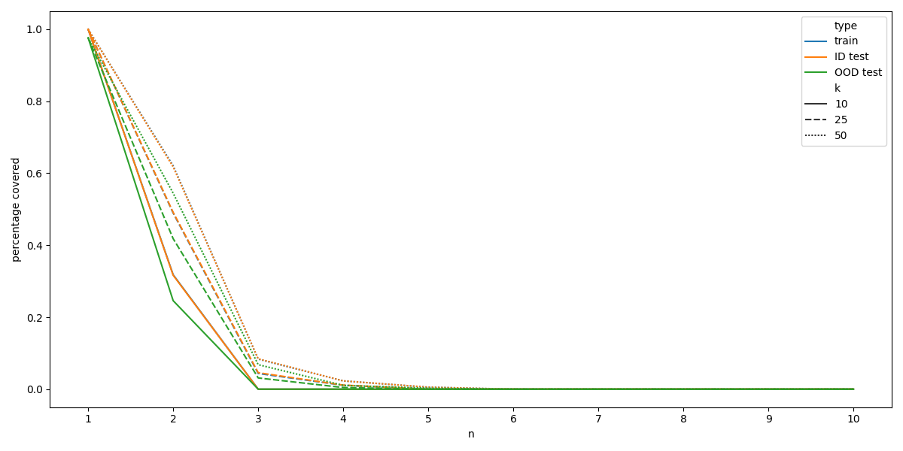
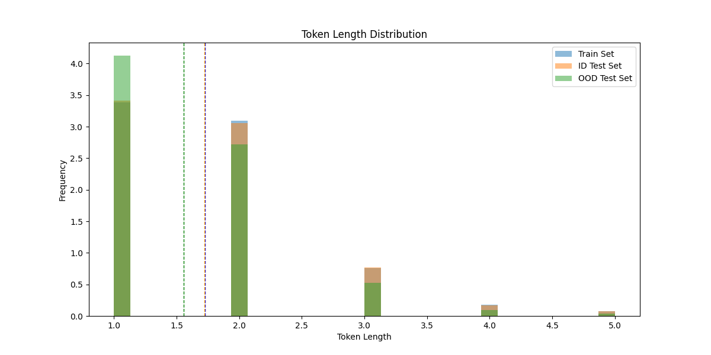
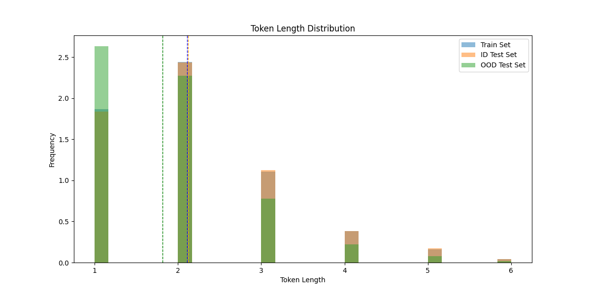
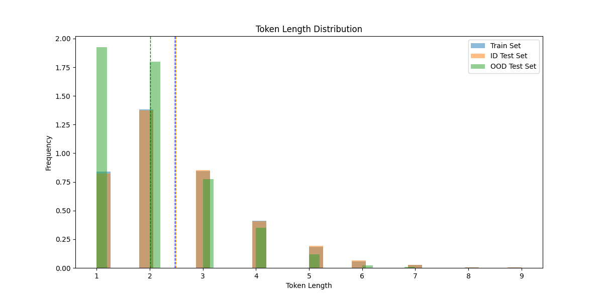
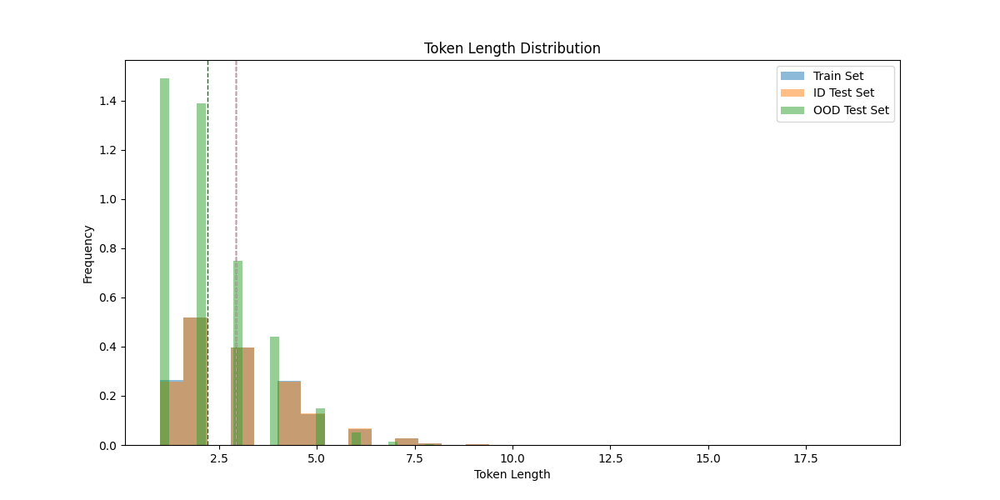
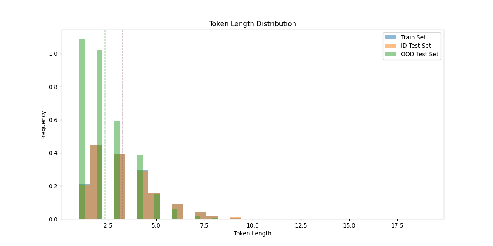
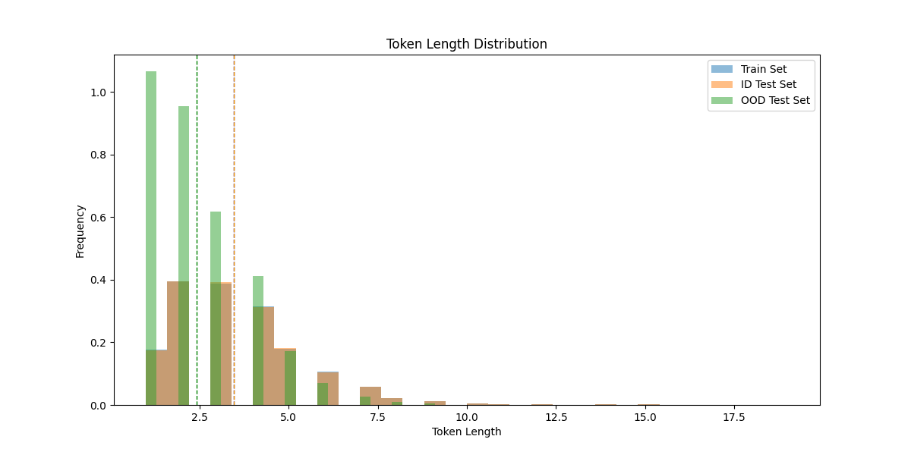
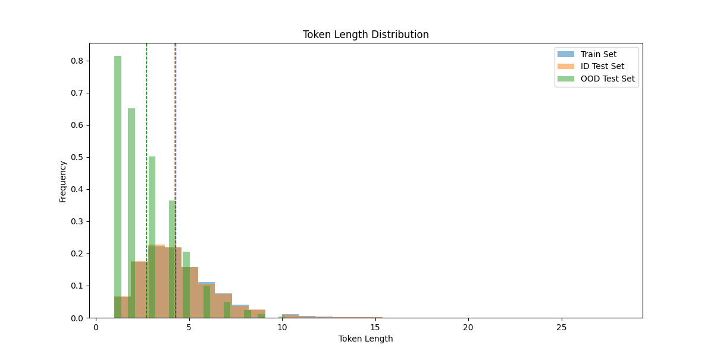
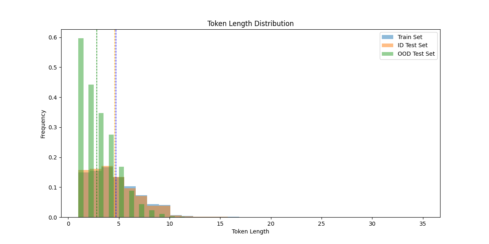

# REPORT
Our implementation demonstrates the evolution of natural language processing techniques, from simple statistical methods to more sophisticated neural approaches. The code is structured modularly, with separate implementations for BPE tokenization, classical n-gram models, and neural n-gram networks.


## Task 0: Text Analysis
To get an overview of the data, we implemented both Unix-style commands and Python equivalents for analyzing the initial Shakespeare corpus. The analysis revealed the fundamental characteristics of the text that would inform our subsequent modeling decisions.

### 0.1 Space-based Tokenization
The initial corpus analysis was performed using space-based tokenization to understand word frequency distributions. We implemented both shell-style and Python approaches:

Bash command:
```bash
tr -sc 'A-Za-z' '\n' < shakespeare.txt | sort | uniq -c | sort -n -r
```

Python implementation:
```python
import re
import numpy as np

def tokenize():
    with open('shakespeare.txt') as f:
        s = f.read()
        pattern = r'[^A-Za-z]+'
        n = re.sub(pattern=pattern, repl='\n', string=s)
        n = n.split('\n') 
        values, counts = np.unique(n, return_counts=True)
        sorted_indices = np.argsort(counts)
        values = values[sorted_indices]
        counts = counts[sorted_indices]
        return list(zip(reversed(counts), reversed(values)))
```
The analysis revealed the most frequent tokens in the original corpus:
```
23288 the
22225 I
18653 and
16373 to
15725 of
12797 a
12186 you
10839 my
10016 in
8954 d
```
This frequency distribution follows the expected Zipfian distribution typical of natural language, with function words dominating the vocabulary.


## Task 1: Data Preparation and Segmentation with BPE

### 1.1 Data Splitting and Cleaning
The initial corpus required substantial preprocessing to remove metadata and licensing information that appeared throughout the text. Our preprocessing pipeline included:

- Whitespace normalization: Collapsing multiple whitespace characters into single spaces using `' '.join(corpus.split())`
- Case normalization: Converting to lowercase using `corpus.casefold()` for better Unicode handling
- Corpus splitting: Extracting test sets as random samples of specified percentages

The cleaning process significantly reduced corpus size:

Original corpus: 4,941,133 characters (901,325 words)
Cleaned corpus: 1,041,007 characters (190,999 words)

A cleaned version of the corpus with proper train/test/validation splits was provided by course participant Mohamed Ebrahim, which we used for subsequent experiments.


### 1.2 BPE Implementation
We implemented Byte Pair Encoding (BPE) as a subword tokenization method. The algorithm follows these key steps:

1. Initialization: Start with individual characters as the initial vocabulary
2. Pair counting: Count all adjacent token pairs in the corpus
3. Merging: Replace the most frequent pair with a new merged token
4. Iteration: Repeat until k merges are completed

Our implementation supports both serial and parallelized processing:
```python
def get_most_frequent_pair(self, corpus):
    """Return the most frequent pair of neighboring tokens in corpus"""
    d = Counter()
    if len(corpus) < 2:
        return None, None
    for comb in zip(corpus, corpus[1:]):
        d[comb] += 1
    if not d:
        return None, None
    pair = d.most_common(1)[0][0]
    return pair
```

### 1.3 Performance Evaluation
We evaluated BPE performance across different test sets to measure generalization:

In-domain (ID) test: Shakespeare test set from the same source
Out-of-domain (OOD) test: SMS dataset with different linguistic characteristics

We used two methods to evaluate performance, coverage analysis and comparison of token length distribution.
Coverage analysis: Percentage of text covered by tokens of various lengths
Token length distribution: compares the distribution of the token lengths of the segmented text for different datasets. The distributions should be similar if the tokenizer generalized well to the other dataset. 

The evaluation used coverage metrics, measuring how well the learned vocabulary segments unseen text. We tested multiple values of k (number of merges) ranging from 100 to 10,000.
#### Coverages


#### Token length distributions












[TODO] describe/analyze results

### 1.4 Accuracy Measurement
We measured segmentation quality using coverage percentages - the fraction of characters in test text that could be represented by tokens of minimum length n. This metric captures how well the BPE vocabulary generalizes to new text while avoiding over-segmentation.
The BPE class includes comprehensive evaluation methods:
```python
def evaluate(self, vocab, test_set, max_n=3):
    # check percentage of text covered by all tokens, then with increasing n
    coverages = []
    matched_chars = []
    
    for n in range(1, max_n + 1):
        t, coverage, m = self.test(vocab, test_set, min_token_length=n)
        coverages.append(coverage)
        matched_chars.append(m)
    
    return coverages
```


## Task 2: N-gram Engine
> "All the world's a stage, and all the men and women merely players; they have their exits and their entrances, and one man in his time plays many parts."
 — William Shakespeare

> "_All the world's a stage,_'--or 'i' the world is slain. iras cleopatra o noble weak, lo, here it is. iago nay, but not in my heart of breath: it is a customach, adieutenant-gown upon the best to have it so. o, iago? iago why, by making quince, snout snout snout snout sn"
 — Shakespeare n-gram (k=1000, n=3: , greedy sampling)

### 2.1 Data Usage and Validation Strategy
As defined in the task, we utilized the cleaned Shakespeare corpus with proper train/test/validation splits for all n-gram experiments. The validation set served specifically for hyperparameter optimization in interpolation models, while k values were treated as a separate experimental variable. 

### 2.2 N-gram Engine Implementation
Our n-gram implementation supports arbitrary n (provided adequate computational resources are available) and includes both Laplace smoothing and simple interpolation. The core architecture uses matrices to store frequencies and probabilities for all n:

```python
class NGram:
    def _init_(self, vocab, n=4, laplace_smoothing=True, interpolation=False, backoff=False, lambdas=None):
        self.n = n
        self.n_gram_contexts = []  # contexts for each n-gram level
        self.vocab = vocab
        self.n_gram_probabilities = []  # probability matrices
        self.n_gram_frequencies = []   # frequency matrices
```

The n-gram engine operates on BPE-tokenized text, allowing for subword-level language modeling. This approach combines the benefits of subword regularization with statistical language modeling.

Laplace smoothing in the training by adding one to all frequencies:
``` python
def train(self, train):
    (...)
    # optional smoothing
        if self.laplace_smoothing:
            self.n_gram_frequencies[n] += 1
    (...)
```

Interpolated probabilities are obtained by interpolating between probabilities for a token and the corresponding context for different ns, with the degree of influence determined by lambdas. These hyperparameters have to be optimized on the validation set after the N-gram has been trained (i.e. the frequency counts have been obtained) and before interpolated probabilities can be computed. 
We implemented a simple optimization of the lambda hyperparameters using random search with optional parallelization to speed up the process of drawing many samples for optimization: 
```python
def optimize_lambdas(self, validation, strategy="random", samples=1000, grid=None, parallelize=True):
    # strategy options: random, grid(search),
    rng = np.random.default_rng()
    best_lambdas = [-1, -1, -1]
    best_probability = -np.inf

    if strategy == "random":
        if parallelize:
            # search for lambdas that best optimize probability of the validation set
            # arguments for worker processes
            args_list = [(samples//self.num_workers, validation, i)
                            for i in range(self.num_workers-1)]
            # handle last one specifically as the number of samples might be different
            args_list.append((samples-((samples//self.num_workers)
                                * (self.num_workers-1)), validation, self.num_workers-1))

            results = self.pool.map(
                self._random_optimizer_worker, args_list)

            for lambdas, probability in results:
                if probability > best_probability:
                    best_lambdas = lambdas
                    best_probability = probability
        else:
            for _ in tqdm(range(samples)):
                # sample lambdas
                lambdas = rng.random(self.n)
                lambdas = lambdas/np.sum(lambdas)

                probability = self.get_interpolated_probabilities(
                    validation, lambdas)

                if probability > best_probability:
                    best_lambdas = lambdas
                    best_probability = probability

    self.lambdas = best_lambdas
    return best_lambdas, best_probability
```

### 2.3 Intrinsic Evaluation
#### 2.3.1 Perplexity Computation

Perplexity serves as our primary intrinsic evaluation metric:
```python
def test_perplexity(self, test):
    probability = self.get_probability(test)
    return np.power(2, -probability/len(test))
```

#### 2.3.2 Multi-order Analysis
We tested n-gram orders from 1 to 4, examining how increased context length affects modeling performance. Higher-order models capture more linguistic structure but suffer from increased sparsity.
[TODO] plot and description

#### 2.3.3 Effect of k on perplexity
We systematically evaluated how different values of k (BPE merge operations) affect perplexity when n is kept constant. As specified in the task, we focused on bigrams due to their balance of context and computational efficiency.
As evident from the plot below, higher ks tend to lead to higher perplexity values, not only on the test but also on the training and validation sets. This is not surprising, however, as higher k values corresponding to more merges in the BPE, and thus a larger vocabulary, leading to individual probabilities in the matrix being reduced due to the larger number of possibilities and the smoothing being applied.
[TODO] plot


### 2.4 Extrinsic Evaluation
#### 2.4.1 Text Generation
Our n-gram models support both greedy and sampling-based text generation:
```python
def predict(self, context, max_length=10, method="greedy", end_of_sequence_tokens=['.', '!', '?']):
    # Generate text using either greedy selection or probabilistic sampling
    while next_token not in end_of_sequence_tokens and len(sequence) < max_length:
        if method == "greedy":
            best_index = np.argmax(probabilities)
        elif method == "sample":
            best_index = np.random.choice(np.arange(len(self.vocab)), p=probabilities)
        
        next_token = self.vocab[best_index]
        sequence.append(next_token)
```

#### 2.4.2 Context Handling
The generation system handles variable-length contexts and implements fallback strategies for unseen n-grams. End-of-sequence tokens (periods, exclamation marks, question marks) provide natural stopping criteria for generated text.


## Task 3: Neural N-Gram
### 3.1 Neural Architecture
We implemented a neural n-gram model using PyTorch, representing contexts as learned embeddings:
```python
class NeuroNgram(nn.Module):
    def _init_(self, vocab, n=2):
        super()._init_()
        self.n = n
        self.vocab = vocab
        self.vocab_size = len(vocab)
        self.embedding = nn.Embedding(self.vocab_size ** (self.n - 1), self.vocab_size)
```
The model encodes n-gram contexts as single indices by treating them as base-vocab_size numbers, enabling direct embedding lookup.


### 3.2 Training Infrastructure
#### 3.2.1 Early Stopping Implementation
We implemented early stopping with configurable patience to prevent overfitting:

```python
def train(model, data, writer, optimizer=None, patience=5, validate_every_x=1):
    steps_without_validation_improvement = 0
    best_valid_loss = torch.inf
    
    for step in range(steps):
        # Training step
        if validation_data is not None and step % validate_every_x == 0:
            _, loss, pp = model(x, y)
            if loss < best_valid_loss:
                best_valid_loss = loss
                steps_without_validation_improvement = 0
                # Save model checkpoint
            else:
                steps_without_validation_improvement += 1
            
            if steps_without_validation_improvement >= patience:
                logger.info(f"Early stopping triggered at step {step}")
                break
```

#### 3.2.2 Model Checkpointing
The system saves top-k model checkpoints based on validation performance, automatically managing storage by removing older checkpoints when the limit is exceeded.


### 3.3 Hyperparameter Optimization
We conducted systematic hyperparameter exploration across multiple dimensions:
Optimizer Variants: We tested 12 different optimizer configurations:

SGD with and without momentum
Adam with learning rates: 1e-4, 1e-2, 1e-1, 25e-2, 5e-1
AdamW with learning rates: 1e-4, 1e-2, 1e-1, 25e-2, 5e-1

BPE Vocabulary Size (k): Tested values from 100 to 10,000 merges to study the effect of subword vocabulary size on neural model performance.
Architecture Parameters: Fixed n=2 for systematic comparison, with configurable context and batch sizes.


### 3.4 Evaluation and Generation
The neural n-gram model supports the same evaluation metrics as classical n-grams:
```python
def evaluate_perplexity_on_test(self, tokenized_test, batch_size=None, context_size=None):
    # Compute perplexity on test data using the trained neural model
    logits, loss, pp = self.forward(context=x, target=y)
    return pp
```
Text generation uses probabilistic sampling from the learned distribution:
```python
def predict(self, context, max_new_tokens=50):
    for i in range(max_new_tokens):
        logits, loss, _ = self(encoded_context)
        probs = F.softmax(logits[:, -1, :], dim=-1)
        next_context = torch.multinomial(probs, num_samples=1)
        prediction = torch.cat((prediction, next_context), dim=1)
    return prediction
```

Experimental Results
Our experiments revealed several key insights:

BPE Vocabulary Size: Larger vocabularies (higher k) generally improved performance up to a point, with diminishing returns beyond k=2000-5000 depending on the model type.
N-gram Order: Classical n-grams showed better performance around n=3-4, balancing context richness with sparsity issues.

Smoothing Effectiveness: Linear interpolation consistently outperformed simple Laplace smoothing, with optimized lambda weights providing substantial improvements.

Neural vs. Classical: Neural n-gram models showed promise but required careful hyperparameter tuning to match classical model performance.

Generalization: All models showed expected degradation when tested on out-of-domain data (SMS vs. Shakespeare), with BPE helping to maintain some robustness.

## Task 4: GPT
### TODO: add the parts from the new parts


## References

**Shakespeare Dataset**  
The Complete Works of William Shakespeare. (n.d.). Project Gutenberg. https://www.gutenberg.org/ebooks/100

**SMS Spam Collection Dataset**  
Almeida, T. A., Hidalgo, J. M. G., & Yamakami, A. (2011). SMS Spam Collection v.1. UCI Machine Learning Repository. https://archive.ics.uci.edu/ml/datasets/SMS+Spam+Collection
