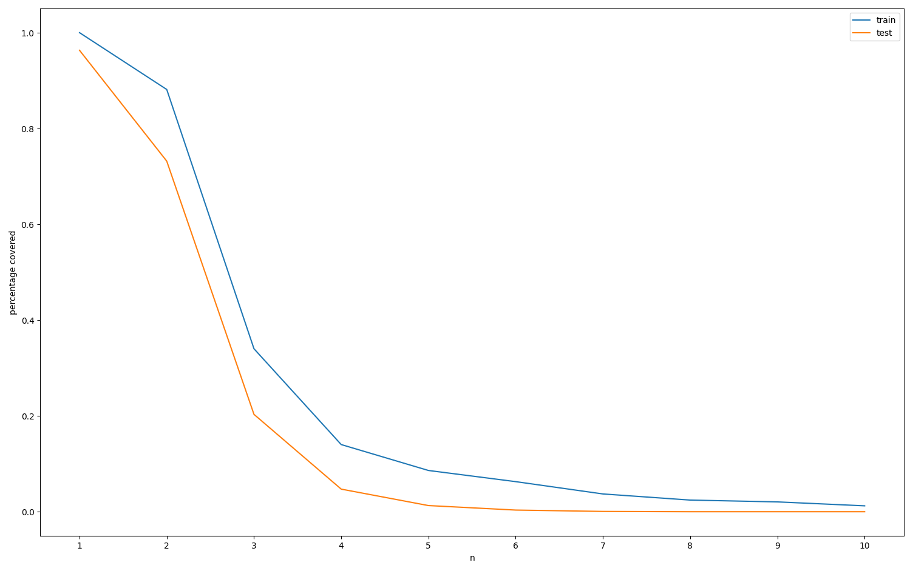

# Report on the project 
## Contents:
### Task 1: 
- make shakespeare into test 1% and train
- train segmenter with varying k, try normalization strategies
- compare the performane against a different set
- figure out a measure for accuracy

### Task 2:
- Use cleaned shakespeare file / provided train-test-validation split
- use validation set to optimize hyperparameters in interpolation, not to optimize k
- develop n-gram engine based on BPE that can deal with different n (uni-, bi, tri, 4-gram), intrinsic evaluation for each:
    - report perplexity on BPE subwords 
        - for bigram: look at how different k's affect perplexity
    - laplace smoothing 
    - simple interpolation or backoff
- write program for extrinsic evaluation (gen. sentence from n-gram system)
    - give context
    - predict next word w. argmax or sampling
        - if word missing: avg. prob. of all or most likely word of unigram
        - use end-of-sequence tokens to determine generation stop

### Task 3 / softer version:
- implement early stopping w. patience
    - optional: optimize patience
    - save top k of model checkpoints
- tune hyperparams using grid search for each separately in this order: k, lr, interpolation weights
- try versions with different optimizers

# Report on the Seminar "Building GPT from Scratch"
TODO: add bpe, n-gram, or transformer quotes (find a good one for each - put the quotes at the beginning of the respective sections), maybe put the best one here next to the william shakespeare quote
```markdown
> "All the world's a stage, and all the men and women merely players; they have their exits and their entrances, and one man in his time plays many parts."
 — William Shakespeare
```
```markdown
> "gce are ld to whom theverby ld enat ed es fsiitat verra, and but not etdlacag ofigh; haqu it his"
 — Shakespeare neural n-gram
``` 

## Introduction
This report documents the work of our group throughout the seminar "Building GPT from Scratch", held by Prof. Elia Bruni at University of Osnabrück, Summer Semester of 2025. During the seminar, we fulfilled a set of milestone tasks, according to which the report is ordered. Each subsequent task builds on the previous ones, culminating in the implementation of a simple GPT-like transformer model (TODO: link the blog post and cite the paper here).
Our code is available alongside this report at (TODO: github link here).

## Task 0: Text 
To get an overview of the data, a few unix commands were run on the initially provided corpus (shakespeare.txt TODO cite).
The commands were translated to python and are provided below.

### 0.1 Space-based Tokenization
```bash
tr -sc 'A-Za-z' '\n' < shakespeare.txt | sort | uniq -c |sort -n -r 
````
```
  23288 the
  22225 I
  18653 and
  16373 to
  15725 of
  12797 a
  12186 you
  10839 my
  10016 in
   8954 d
```

python equivalent:
```python
import re
def tokenize():
    with open('shakespeare.txt') as f:
        s=f.read()
        pattern = r'[^A-Za-z]+'
        n = re.sub(pattern=pattern, repl='\n', string=s)
        n = n.split('\n') 
        values, counts = np.unique(n, return_counts=True)
        sorted_indices = np.argsort(counts)
        values = values[sorted_indices]
        counts = counts[sorted_indices]
        return list(zip(reversed(counts), reversed(values)))

t = tokenize()
for (count, string) in t:
    print(f"{count} {string}")
```
```
23288 the
22225 I
18653 and
16373 to
15725 of
12797 a
12186 you
10839 my
10016 in
8954 d

```
## Task 1: Data Preparation and Segmentation with BPE
### 1.1 Data Splitting
We cleaned and divided the initially provided shakespeare corpus by collapsing all groups of whitespaces into one space each, then performing space-based splitting (TODO: add pseudocode or our fct here). Our test set generation (mostly for BPE) was a simple implementation of extracting a percentage of text (TODO add code). However, the corpus contained licence information and such not only in the beginning, but repeatedly throughout the entire text, so improvements to our data cleaning became necessary.

Before we could refine our functionality, a cleaned version of the corpus, split into train, test, validation, as well as a concatenated version of the three, was kindly provided to all by course participant Mohamed Ebrahim, making our version obsolete.

The rough amount of removed characters becomes apparent when printing character amount and word amount (split at whitespaces):

```python
>>> print(len(shakespeare))
4941133
>>> print(len(Shakespeare_clean_full))
1041007
>>> print(len(shakespeare.split()))
901325
>>> print(len(Shakespeare_clean_full.split()))
190999
```

### 1.2 Segmenter Training
Explain the training of the segmenter, including different values of k and normalization strategies.

### 1.3 Performance Comparison
We evaluated the performance by applying the segmenter to different test sets:

- ```Shakespeare_clean_full.txt```, 10% extracted after training the segmenter on it 
- ```Shakespeare_clean_test.txt``` - A subset of the original corpus, extracted before training the segmenter
- ```sms_clean.txt``` - a version of the sms dataset (TODO cite / name correctly) with the spam/ham labels removed.

We expected the segmenter - if it works correctly - to perform best on the corpus extracted after training (since it is a subset of the training data), a bit worse on the Shakespeare test set (since it is in a similar style, but not exactly the training data), and worst on the sms dataset (since the style is very unlike Shakespeare). (TODO change "style" to something more technically relevant to order of tokens)
TODO add figures and stuff, maybe merge with next section.

### 1.4 Accuracy Measurement
Detail the chosen accuracy metric and its justification.

Figure showing the coverage of the vocabulary with respect to the token length for different corpora: 

NOTE this is a placeholder figure

## Milestone 2: N-gram Engine 
### 2.1 Data Usage and Splitting
Summarize the use of cleaned data and the provided splits.

### 2.2 Hyperparameter Optimization
Describe the use of the validation set for tuning interpolation hyperparameters.

### 2.3 N-gram Engine Implementation
#### 2.3.1 BPE Subword Modeling
Explain the BPE-based n-gram engine and its support for various n.

#### 2.3.2 Intrinsic Evaluation
Detail the intrinsic evaluation methods, including perplexity reporting and the effect of k.

#### 2.3.3 Smoothing and Interpolation
Describe the implementation of Laplace smoothing and interpolation/backoff strategies.

### 2.4 Extrinsic Evaluation
#### 2.4.1 Sentence Generation
Explain the program for generating sentences from the n-gram system.

#### 2.4.2 Prediction Strategies
Discuss context-based prediction, handling missing words, and stopping criteria.

## Milestone 3: Neural N-Gram
### 3.1 Early Stopping
Describe the implementation of early stopping and optional patience optimization.

### 3.2 Model Checkpointing
Explain how top k model checkpoints are saved.

### 3.3 Hyperparameter Tuning
Detail the grid search process for k, learning rate, and interpolation weights.

### 3.4 Optimizer Variants
Discuss experiments with different optimizers.

## Milestone 4: GPT
### TODO: add the parts from the new parts


## References

**Shakespeare Dataset**  
The Complete Works of William Shakespeare. (n.d.). Project Gutenberg. https://www.gutenberg.org/ebooks/100

**SMS Spam Collection Dataset**  
Almeida, T. A., Hidalgo, J. M. G., & Yamakami, A. (2011). SMS Spam Collection v.1. UCI Machine Learning Repository. https://archive.ics.uci.edu/ml/datasets/SMS+Spam+Collection
